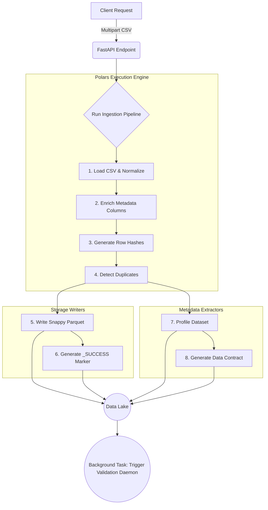

# Ingestion Subsystem: Engineering Handover

**Version:** 1.0.0
**Status:** Production Ready
**Scope:** Data Ingestion, Orchestration, Profiling, and Storage Serialization

---

## 1. Executive Summary

This document serves as the technical handover for the Data Quality Platform's **Ingestion Subsystem**. This module is an entirely isolated, horizontally scalable orchestration engine designed to convert raw payloads (e.g., CSV) into highly structured, Snappy-compressed Parquet datasets while simultaneously auto-generating runtime statistics (Profiles) and schema definitions (Contracts).

**Crucial Integration Boundary:** The Ingestion subsystem exclusively handles data ingestion, transformation, and storage. It **does not** evaluate data quality rules. Instead, it asynchronously triggers the existing Validation Daemon upon successful partition write. The Validation engine is intended to consume the artifacts generated here.

---

## 2. Ingestion Architecture

The ingestion process is completely synchronous through its core pipeline stages, utilizing Polars for C-optimized vectorized operations, but is invoked via an asynchronous FastAPI route to support high concurrency.



---

## 3. Pipeline Stages

The `app.ingestion.services.ingestion_service` orchestrates 9 sequential operations:

1.  **CSV Ingestion:** Streaming load of the raw CSV file to disk, followed by optimized `pl.read_csv` memory mapping.
2.  **Column Normalization:** Replaces spaces with underscores and converts column headers to snake_case.
3.  **Metadata Enrichment:** Injects platform metadata (e.g., `__ingested_at`, `__batch_id`).
4.  **Hash Generation:** Computes a SHA-256 fingerprint (`__row_hash`) for each row based on the raw payload content.
5.  **Duplicate Detection:** Flags rows as duplicates (`__is_duplicate=True`) utilizing the `__row_hash`.
6.  **Parquet Partitioning:** Streams the enriched dataframe to disk using PyArrow with `snappy` compression.
7.  **Dataset Profiling:** Computes deep statistical distributions (null counts, percentiles, top values) for every column.
8.  **Contract Generation:** Formulates a static JSON Schema representing the structural invariants to monitor for pipeline drift.
9.  **Success Validation:** Atomically creates a `_SUCCESS` marker validating the partition write completed without corruption.

---

## 4. Storage & Folder Structure

All artifacts are persisted into the configured `STORAGE_DIR` (Default: `/tmp/data_lake`). The structure explicitly isolates formats for decoupled downstream reading.

```text
/tmp/data_lake/
│
├── {dataset_name}/                                  # 1. Physical Parquet Data
│   └── partition_date=YYYY-MM-DD/
│       ├── batch_{uuid}.parquet
│       └── _SUCCESS_batch_{uuid}
│
├── profiling/                                       # 2. Statistical Profiles
│   └── {dataset_name}_batch_{uuid}/
│       └── latest/
│           └── profile.json
│
└── contracts/                                       # 3. Schema Contracts
    └── {dataset_name}/
        └── contract_v1.0.0.json
```

---

## 5. Artifact Schemas

### 5.1 System Metadata Columns
The following protected columns are appended to every ingested dataframe:

| Column | Polars Type | Purpose |
| :--- | :--- | :--- |
| `__batch_id` | `Utf8/String` | Lineage tracking across the platform. |
| `__ingested_at` | `Datetime(ms)`| UTC timestamp of ingestion. |
| `__row_hash` | `Utf8/String` | SHA-256 deterministic hash of row contents. |
| `__is_duplicate`| `Boolean` | True if `__row_hash` appeared previously in the batch. |

### 5.2 The `_SUCCESS` Marker
Generated atomically after Parquet writes. Validates to downstream readers (Spark/Trino/Daemon) that the partition isn't partially written.

```json
{
  "batch_id": "batch_8a2b9f33c1d4",
  "row_count": 50000,
  "completed_at": "2026-05-15T17:40:00+00:00",
  "schema_version": "1.0.0"
}
```

### 5.3 The `profile.json` Layout
Computed via `DatasetProfiler`. Captures mathematical states at the exact moment of ingestion.

```json
{
  "dataset_name": "employees_batch_8a2b9f33c1d4",
  "row_count": 50000,
  "column_count": 8,
  "columns": {
    "salary": {
      "inferred_data_type": "Int64",
      "null_count": 12,
      "null_percentage": 0.024,
      "unique_count": 450,
      "min": 45000,
      "max": 120000,
      "percentiles": {
        "25": 55000,
        "50": 72000,
        "75": 90000
      }
    }
  }
}
```

### 5.4 The `contract.json` Layout
Computed via `ContractGenerator`. Represents expected invariants.

```json
{
  "dataset_name": "employees",
  "generated_at": "2026-05-15T17:40:00+00:00",
  "version": "1.0.0",
  "schema": {
    "salary": "Int64",
    "department": "String"
  },
  "quality_baselines": {
    "salary": {
      "observed_min": 45000,
      "max_null_percentage_allowed": 0.024
    }
  },
  "incremental_configuration": {
    "strategy": "append"
  }
}
```

---

## 6. API Contracts

### `POST /ingestion/datasets/upload/csv`
Triggers the full E2E pipeline.

**Request:** `multipart/form-data`
* `dataset_name`: `string` (Query Param)
* `file`: `bytes` (CSV upload)

**Response (HTTP 201):**
```json
{
  "status": "success",
  "batch_id": "batch_8a2b9f33c1d4",
  "dataset_name": "employees",
  "row_count": 50000,
  "parquet_path": "/tmp/data_lake/employees/partition_date=2026-05-15/batch_8a2b9f33c1d4.parquet",
  "profile_path": "/tmp/data_lake/profiling/employees_batch_8a2b9f33c1d4/latest/profile.json",
  "contract_path": "/tmp/data_lake/contracts/employees/contract_v1.0.0.json",
  "ready_for_validation": true,
  "duplicate_count": 5,
  "execution_time_ms": 1250
}
```

---

## 7. Downstream Consumption (Validation Systems)

**Integration Boundary Constraints:**
The Validation Systems (Daemon / Rule Evaluator) should adhere to the following consumption patterns:

1.  **Wait for the Marker:** Do not read Parquet partitions unless the `_SUCCESS_{batch_id}` file is verified to exist within the partition directory.
2.  **Read Native Parquet:** The validation system should leverage Polars or PyArrow to read the `.parquet` datasets directly using the `parquet_path` passed to `ValidationTriggerService.trigger_validation`.
3.  **Consume the Profile:** Rules like "Null Percentage thresholds" do not require recalculating the dataframe. The validation module can parse `/profiling/{dataset_name}_batch_{uuid}/latest/profile.json` to immediately execute data quality rules at O(1) time complexity.
4.  **Ignore System Columns:** Data quality rules should natively ignore columns prefixed with `__` (e.g., `__row_hash`) unless specifically evaluating duplication logic (`pl.col('__is_duplicate') == True`).
