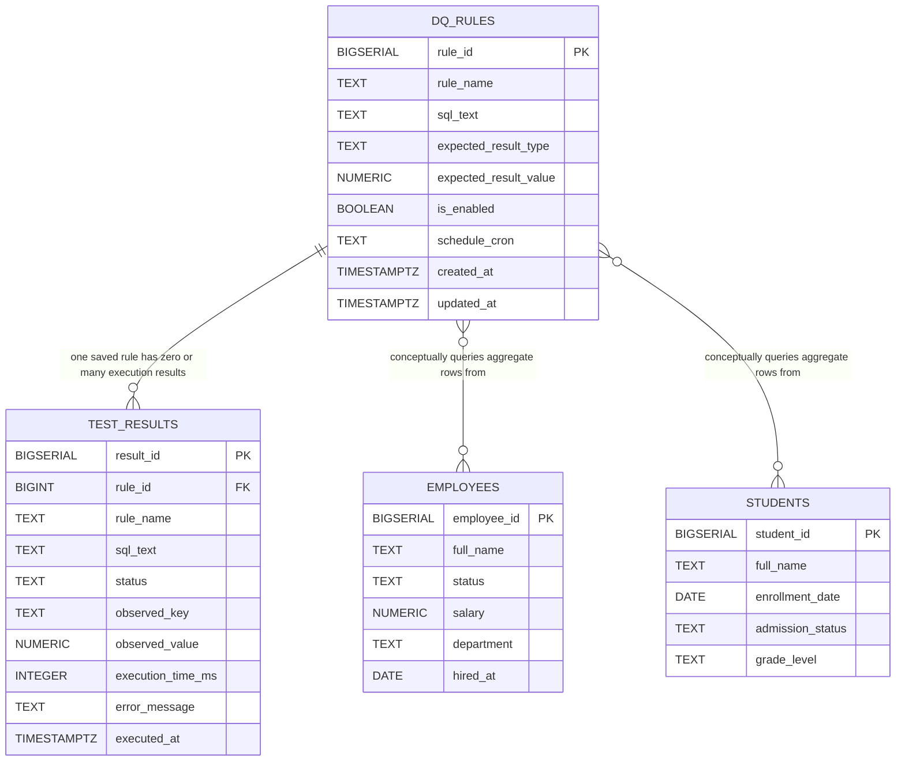

# Data Quality Daemon

Dockerized FastAPI and PostgreSQL test harness for SQL-based data quality rules.

Current scope:

- Ad hoc SQL rule execution with `POST /rules/run`
- Persistent approved rule registry
- Manual execution of saved rules
- APScheduler-based execution of enabled saved rules with cron schedules
- Persisted execution results linked back to saved rules

Still intentionally out of scope: LLM generation, natural-language parsing, dynamic schedule reload, and UI.

## Run

Create a local `.env` from `.env.example` and set local database passwords:

```bash
cp .env.example .env
```

```bash
docker compose up --build
```

The API starts at:

```text
http://localhost:8000
```

`docker compose up --build` starts three services:

- `postgres`: PostgreSQL test database
- `api`: FastAPI service
- `scheduler`: long-running APScheduler daemon

PostgreSQL starts with:

- database: `dq_test`
- superuser: `postgres`
- execution role for submitted SQL: `dq_executor`
- metadata role for saved rules/results: `dq_app`
- schemas: `business_data`, `dq_config`, `dq_results`

If you already ran an older milestone with a persistent Docker volume, recreate the database once so the new registry schema is initialized:

```bash
docker compose down -v
docker compose up --build
```

## SQL Contract

Rule SQL must be one `SELECT` statement returning exactly one row and one numeric aggregate column named `violation_count` or `observed_value`.

The API rejects obvious mutation and DDL statements before saving or executing SQL. Actual rule execution uses the restricted `dq_executor` role inside a read-only transaction with a statement timeout.

## Ad Hoc Execution

Use this endpoint for one-off SQL rules that are not saved:

```http
POST /rules/run
```

```bash
curl -X POST http://localhost:8000/rules/run \
  -H "Content-Type: application/json" \
  -d '{
    "rule_name": "No active employee has negative salary",
    "sql": "SELECT COUNT(*) AS violation_count FROM business_data.employees WHERE status = '\''active'\'' AND salary < 0;",
    "expected_result": {
      "type": "zero_violations"
    }
  }'
```

## Saved Rules

### Create Rule

```http
POST /rules
```

```bash
curl -X POST http://localhost:8000/rules \
  -H "Content-Type: application/json" \
  -d '{
    "rule_name": "No active employee has negative salary",
    "sql": "SELECT COUNT(*) AS violation_count FROM business_data.employees WHERE status = '\''active'\'' AND salary < 0;",
    "expected_result": {
      "type": "zero_violations"
    },
    "schedule_cron": null,
    "is_enabled": true
  }'
```

### List Rules

```bash
curl http://localhost:8000/rules
```

### Get One Rule

```bash
curl http://localhost:8000/rules/1
```

### Run Saved Rule Now

```bash
curl -X POST http://localhost:8000/rules/1/run
```

The result is persisted to `dq_results.test_results` with `rule_id = 1`.

### Get Recent Results For A Rule

```bash
curl http://localhost:8000/rules/1/results?limit=20
```

## Scheduled Rules

Saved rules are schedulable when:

- `is_enabled` is `true`
- `schedule_cron` is not null
- `schedule_cron` is a valid standard 5-field cron expression

Cron fields are interpreted as:

```text
minute hour day_of_month month day_of_week
```

Examples:

```text
*/5 * * * *
0 0 * * *
0 2 * * 1
0 3 1 * *
0 4 1 6 *
```

The scheduler loads rules at startup. For this milestone, changed or newly created schedules require restarting the scheduler container:

```bash
docker compose restart scheduler
```

### Create A Scheduled Rule

```bash
curl -X POST http://localhost:8000/rules \
  -H "Content-Type: application/json" \
  -d '{
    "rule_name": "Scheduled active employee salary check",
    "sql": "SELECT COUNT(*) AS violation_count FROM business_data.employees WHERE status = '\''active'\'' AND salary < 0;",
    "expected_result": {
      "type": "zero_violations"
    },
    "schedule_cron": "*/5 * * * *",
    "is_enabled": true
  }'
```

Invalid cron expressions are rejected at creation time with HTTP `400`.

### Scheduler Classifications

```bash
curl http://localhost:8000/scheduler/rules
```

Each rule is classified as one of:

- `schedulable`
- `disabled`
- `missing_schedule`
- `invalid_cron`

### Jitter

Scheduled jobs apply random execution jitter before running so many rules do not hit PostgreSQL at exactly the same second.

Default jitter is `120` seconds. Override it for local testing:

```bash
RULE_EXECUTION_JITTER_SECONDS=0 docker compose up --build
```

## Expected Result Types

### `zero_violations`

Passes when the aggregate result is `0`.

```json
{
  "type": "zero_violations"
}
```

### `min_threshold`

Passes when the aggregate result is greater than or equal to `value`.

```json
{
  "type": "min_threshold",
  "value": 1000
}
```

### `max_threshold`

Passes when the aggregate result is less than or equal to `value`.

```json
{
  "type": "max_threshold",
  "value": 25
}
```

### `equals`

Passes when the aggregate result exactly equals `value`.

```json
{
  "type": "equals",
  "value": 25000
}
```

## Inspect PostgreSQL

Open `psql`:

```bash
docker compose exec postgres psql -U postgres -d dq_test
```

Saved rules:

```sql
SELECT
    rule_id,
    rule_name,
    expected_result_type,
    expected_result_value,
    is_enabled,
    schedule_cron,
    created_at,
    updated_at
FROM dq_config.dq_rules
ORDER BY rule_id;
```

Execution results:

```sql
SELECT
    result_id,
    rule_id,
    rule_name,
    status,
    observed_key,
    observed_value,
    execution_time_ms,
    error_message,
    executed_at
FROM dq_results.test_results
ORDER BY result_id DESC
LIMIT 20;
```

Results created by the scheduler have the saved rule's `rule_id`.

## Database Relationships

The database has three schemas:

- `business_data`: sample source tables checked by validation SQL
- `dq_config`: saved rule metadata
- `dq_results`: persisted execution results



Cardinality:

- `DQ_RULES ||--o{ TEST_RESULTS`: one saved rule can have zero, one, or many execution result rows.
- `TEST_RESULTS.rule_id` is nullable, so ad hoc `/rules/run` executions can exist without a saved rule.
- `DQ_RULES }o--o{ EMPLOYEES`: conceptual many-to-many read relationship. Many rules may query employee data, and each rule may aggregate over many employee rows.
- `DQ_RULES }o--o{ STUDENTS`: conceptual many-to-many read relationship. Many rules may query student data, and each rule may aggregate over many student rows.

Only `dq_results.test_results.rule_id -> dq_config.dq_rules.rule_id` is enforced as a real foreign key. The relationships to `business_data` tables are conceptual because rules reference those tables through `sql_text`.

## Tests

Run the test suite in Docker:

```bash
docker compose run --rm --no-deps api pytest
```

The tests cover evaluator behavior, SQL safety validation, cron parsing, scheduler classification, scheduled execution dispatch, ad hoc execution behavior, saved-rule endpoint behavior, manual saved-rule execution, and saved-rule result retrieval.

## LLM Drafting & Validation

The Data Quality Daemon now supports generating, validating, and reviewing SQL rules using a Large Language Model (LLM).

The LLM is NOT trusted to create rules directly. Instead, it creates **draft proposals** which must be reviewed and approved by a human.

### Create a Draft

```bash
curl -X POST http://localhost:8000/llm/rules/draft \
  -H "Content-Type: application/json" \
  -d '{
    "prompt": "Check if any active employees have a negative salary",
    "dry_run": true
  }'
```

### List Drafts

```bash
curl http://localhost:8000/llm/rules/drafts
```

### Review Drafts

If the draft is valid and the `dry_run_status` is not ERROR, you can approve it:

```bash
# Approve a draft (creates a real saved rule)
curl -X POST http://localhost:8000/llm/rules/drafts/1/approve

# Reject a draft
curl -X POST http://localhost:8000/llm/rules/drafts/1/reject \
  -H "Content-Type: application/json" \
  -d '{"reviewer_notes": "Needs to use the payroll schema"}'
```
