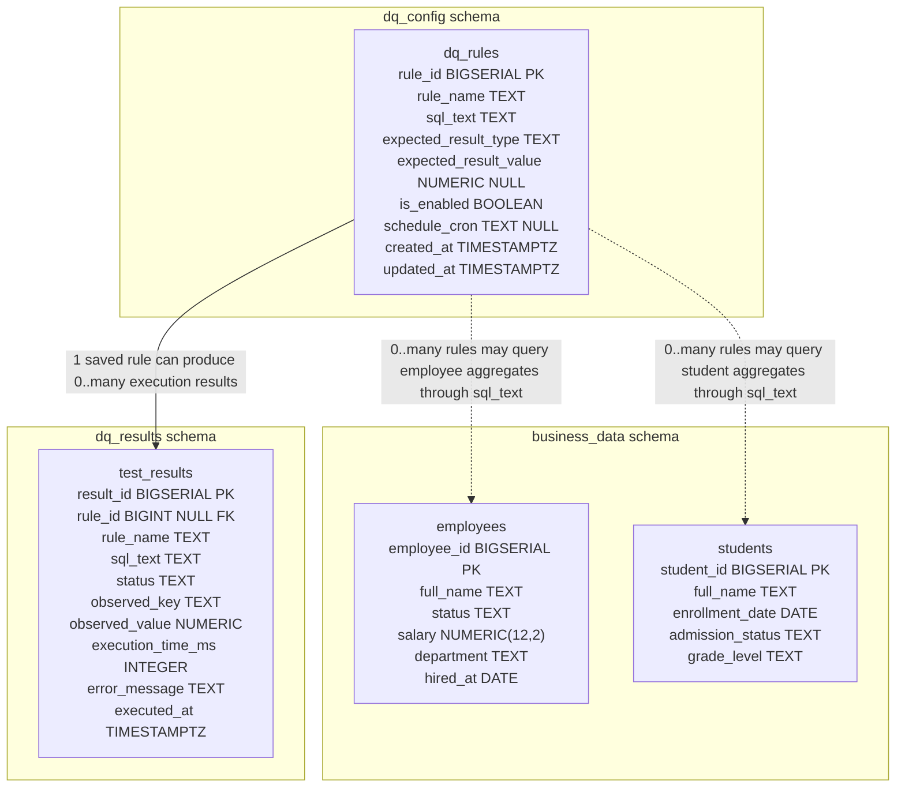
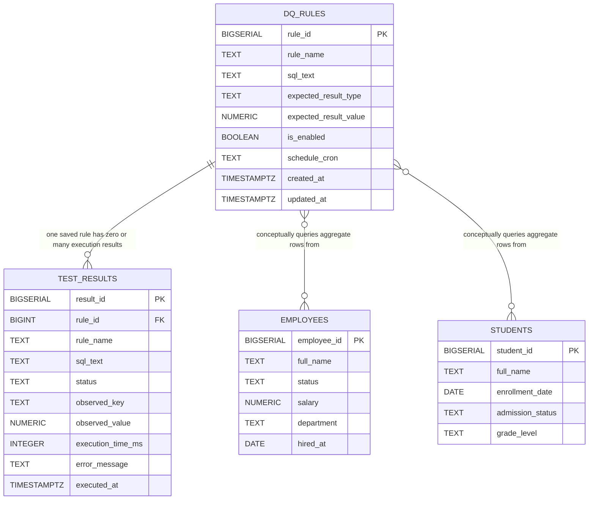
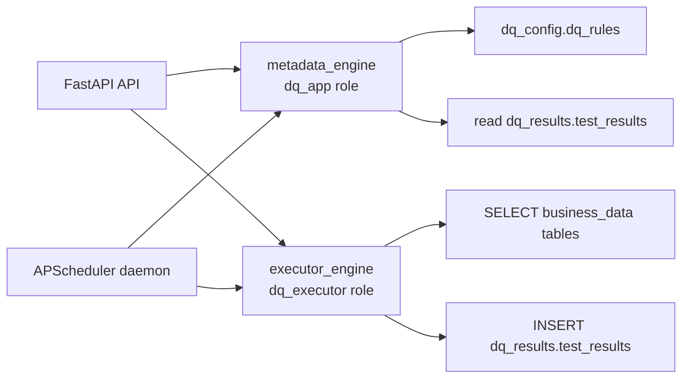

# Project Code Explanation

This document explains the current `/hpe` project file by file. The project is a Dockerized Data Quality Daemon with:

- a FastAPI API
- PostgreSQL schemas and seed data
- a saved rule registry
- a SQL execution daemon
- APScheduler-based scheduled execution
- tests for the core behavior

## API Documentation

Base URL when running locally:

```text
http://localhost:8000
```

All request and response bodies are JSON unless noted otherwise.

### `GET /health`

Checks whether the API process is alive.

Request body: none.

Example response:

```json
{
  "status": "ok"
}
```

### `POST /rules/run`

Runs an ad hoc SQL rule immediately. This does not require the rule to be saved in `dq_config.dq_rules`.

Request body:

```json
{
  "rule_name": "No active employee has negative salary",
  "sql": "SELECT COUNT(*) AS violation_count FROM business_data.employees WHERE status = 'active' AND salary < 0;",
  "expected_result": {
    "type": "zero_violations"
  }
}
```

Supported `expected_result.type` values:

- `zero_violations`: passes when the observed aggregate is `0`
- `min_threshold`: passes when observed value is greater than or equal to `value`
- `max_threshold`: passes when observed value is less than or equal to `value`
- `equals`: passes when observed value equals `value`

For `min_threshold`, `max_threshold`, and `equals`, include `expected_result.value`.

Example response:

```json
{
  "rule_id": null,
  "rule_name": "No active employee has negative salary",
  "status": "FAIL",
  "result": {
    "violation_count": 10
  },
  "expected_result": {
    "type": "zero_violations",
    "value": null
  },
  "execution_time_ms": 159,
  "executed_at": "2026-05-09T10:32:17.241318Z",
  "error": null
}
```

Error response shape still uses HTTP `200` for execution errors, because execution failure is a rule result:

```json
{
  "rule_id": null,
  "rule_name": "Broken SQL",
  "status": "ERROR",
  "result": null,
  "expected_result": {
    "type": "zero_violations",
    "value": null
  },
  "execution_time_ms": 5,
  "executed_at": "2026-05-09T10:32:17.241318Z",
  "error": {
    "type": "SQL_EXECUTION_ERROR",
    "message": "database error details"
  }
}
```

### `POST /rules`

Creates a saved SQL-based data quality rule.

The API validates:

- SQL is a safe single-statement `SELECT`
- dangerous SQL keywords are not present
- `schedule_cron`, if provided, is a valid 5-field cron expression
- threshold/equality expected result types include `value`

Request body:

```json
{
  "rule_name": "Scheduled active employee salary check",
  "sql": "SELECT COUNT(*) AS violation_count FROM business_data.employees WHERE status = 'active' AND salary < 0;",
  "expected_result": {
    "type": "zero_violations"
  },
  "schedule_cron": "*/5 * * * *",
  "is_enabled": true
}
```

Example response:

```json
{
  "rule_id": 2,
  "rule_name": "Scheduled active employee salary check",
  "sql": "SELECT COUNT(*) AS violation_count FROM business_data.employees WHERE status = 'active' AND salary < 0;",
  "expected_result": {
    "type": "zero_violations",
    "value": null
  },
  "schedule_cron": "*/5 * * * *",
  "is_enabled": true,
  "created_at": "2026-05-09T10:26:26.139480Z",
  "updated_at": "2026-05-09T10:26:26.139480Z"
}
```

Invalid SQL or cron returns HTTP `400`:

```json
{
  "detail": {
    "type": "INVALID_CRON",
    "message": "Invalid schedule_cron: Error validating expression..."
  }
}
```

### `GET /rules`

Lists all saved rules.

Request body: none.

Example response:

```json
[
  {
    "rule_id": 1,
    "rule_name": "No active employee has negative salary",
    "sql": "SELECT COUNT(*) AS violation_count FROM business_data.employees WHERE status = 'active' AND salary < 0;",
    "expected_result": {
      "type": "zero_violations",
      "value": null
    },
    "schedule_cron": null,
    "is_enabled": true,
    "created_at": "2026-05-09T10:10:50.437490Z",
    "updated_at": "2026-05-09T10:10:50.437490Z"
  }
]
```

### `GET /rules/{rule_id}`

Returns one saved rule.

Path parameters:

- `rule_id`: saved rule primary key

Example response:

```json
{
  "rule_id": 1,
  "rule_name": "No active employee has negative salary",
  "sql": "SELECT COUNT(*) AS violation_count FROM business_data.employees WHERE status = 'active' AND salary < 0;",
  "expected_result": {
    "type": "zero_violations",
    "value": null
  },
  "schedule_cron": null,
  "is_enabled": true,
  "created_at": "2026-05-09T10:10:50.437490Z",
  "updated_at": "2026-05-09T10:10:50.437490Z"
}
```

If the rule is missing, the endpoint returns HTTP `404`.

### `POST /rules/{rule_id}/run`

Runs a saved rule immediately using the existing executor path.

Path parameters:

- `rule_id`: saved rule primary key

Request body: none.

Example response:

```json
{
  "rule_id": 1,
  "rule_name": "No active employee has negative salary",
  "status": "FAIL",
  "result": {
    "violation_count": 10
  },
  "expected_result": {
    "type": "zero_violations",
    "value": null
  },
  "execution_time_ms": 159,
  "executed_at": "2026-05-09T10:32:17.241318Z",
  "error": null
}
```

The execution result is persisted into `dq_results.test_results` with the same `rule_id`.

### `GET /rules/{rule_id}/results`

Lists recent persisted execution results for one saved rule.

Path parameters:

- `rule_id`: saved rule primary key

Query parameters:

- `limit`: optional, integer from `1` to `100`, default `20`

Example:

```text
GET /rules/1/results?limit=5
```

Example response:

```json
[
  {
    "result_id": 3,
    "rule_id": 1,
    "rule_name": "No active employee has negative salary",
    "status": "FAIL",
    "observed_key": "violation_count",
    "observed_value": 10,
    "execution_time_ms": 331,
    "error_message": null,
    "executed_at": "2026-05-09T10:30:02.718556Z"
  }
]
```

### `GET /scheduler/rules`

Shows whether each saved rule is schedulable based on database state.

This endpoint does not inspect the live scheduler process. It re-evaluates rule metadata from the database.

Request body: none.

Possible `scheduler_status` values:

- `schedulable`: enabled and has a valid cron expression
- `disabled`: `is_enabled` is false
- `missing_schedule`: enabled but `schedule_cron` is null or blank
- `invalid_cron`: enabled but `schedule_cron` is invalid

Example response:

```json
[
  {
    "rule_id": 1,
    "rule_name": "No active employee has negative salary",
    "is_enabled": true,
    "schedule_cron": null,
    "scheduler_status": "missing_schedule"
  },
  {
    "rule_id": 2,
    "rule_name": "Scheduled active employee salary check",
    "is_enabled": true,
    "schedule_cron": "*/5 * * * *",
    "scheduler_status": "schedulable"
  }
]
```

## Database Schema And ER Diagrams

The database has three schemas:

- `business_data`: sample data that rules inspect
- `dq_config`: saved rule configuration
- `dq_results`: persisted execution results

### Schema Overview



### Entity Relationship Diagram



Cardinality:

- `DQ_RULES ||--o{ TEST_RESULTS`: one saved rule can have zero, one, or many execution result rows.
- `TEST_RESULTS.rule_id` is nullable, so ad hoc `/rules/run` executions can exist without a saved rule.
- `DQ_RULES }o--o{ EMPLOYEES`: conceptual many-to-many read relationship. Many rules may query employee data, and each rule may aggregate over many employee rows.
- `DQ_RULES }o--o{ STUDENTS`: conceptual many-to-many read relationship. Many rules may query student data, and each rule may aggregate over many student rows.

The ER diagram has one real database-enforced foreign-key relationship:

- `dq_results.test_results.rule_id` references `dq_config.dq_rules.rule_id`

The relationships between rules and `business_data` tables are conceptual, not database foreign keys. A rule's `sql_text` may query `employees`, `students`, or future business tables.

### Runtime Access Model



`dq_app` manages metadata. `dq_executor` runs validation SQL with restricted read-only access to business data and insert-only access to result logging.

## Root Files

### `guide.md`

This is the architecture and milestone specification used to build the project. It describes the intended system shape:

- FastAPI receives SQL-based data quality rules.
- The daemon validates and executes only safe aggregate `SELECT` queries.
- PostgreSQL stores test data, saved rules, and execution results.
- Docker Compose runs the API and database.
- Later milestones add saved rules and scheduled execution.

The implementation follows this guide while intentionally not adding LLM, natural-language parsing, UI, or production auth.

### `README.md`

This is the user-facing runbook. It documents:

- how to start the stack with `docker compose up --build`
- what services run: `postgres`, `api`, and `scheduler`
- the SQL contract for validation rules
- how to call ad hoc execution with `POST /rules/run`
- how to create, list, fetch, run, and inspect saved rules
- how scheduled rules work
- how to inspect PostgreSQL tables
- how to run tests

It is operational documentation rather than application logic.

### `Dockerfile`

```dockerfile
FROM python:3.12-slim
```

Uses a small Python 3.12 Linux image as the runtime.

```dockerfile
ENV PYTHONDONTWRITEBYTECODE=1
ENV PYTHONUNBUFFERED=1
```

Disables `.pyc` files and makes logs appear immediately in Docker output.

```dockerfile
WORKDIR /app
COPY requirements.txt .
RUN pip install --no-cache-dir -r requirements.txt
```

Creates `/app`, copies dependency declarations, and installs Python dependencies.

```dockerfile
COPY app ./app
COPY tests ./tests
COPY pytest.ini .
```

Copies the app code and tests into the image. Including tests lets `docker compose run --rm --no-deps api pytest` work inside the container.

```dockerfile
EXPOSE 8000
CMD ["uvicorn", "app.main:app", "--host", "0.0.0.0", "--port", "8000"]
```

The default container command starts the FastAPI app on port `8000`. The scheduler service overrides this command in Compose.

### `docker-compose.yml`

Defines three services plus one named volume.

#### `api`

Builds the local Docker image and runs FastAPI. It waits for Postgres to become healthy before starting.

Important environment variables:

- `DATABASE_URL`: connects as `dq_executor`, the restricted role used for executing rule SQL.
- `METADATA_DATABASE_URL`: connects as `dq_app`, the metadata role used for saved rules and result reads.
- `STATEMENT_TIMEOUT_MS`: timeout applied to validation SQL.

Port mapping:

- host `8000` to container `8000`

#### `scheduler`

Builds the same image but runs:

```bash
python -m app.daemon.scheduler
```

This starts the long-running APScheduler daemon. It uses the same database URLs and timeout settings as the API. It also accepts:

```yaml
RULE_EXECUTION_JITTER_SECONDS: ${RULE_EXECUTION_JITTER_SECONDS:-120}
```

That means jitter defaults to `120` seconds, but can be overridden from the host environment.

#### `postgres`

Runs `postgres:16`, exposes port `5432`, and loads initialization scripts from `db/init`.

The healthcheck uses `pg_isready` so API and scheduler startup wait until the database is accepting connections.

#### `postgres_data`

Stores PostgreSQL data persistently across container restarts.

### `requirements.txt`

Lists pinned Python dependencies:

- `APScheduler`: scheduled rule execution
- `asyncpg`: async PostgreSQL driver
- `fastapi`: API framework
- `httpx`: required by FastAPI `TestClient`
- `pydantic`: request and response models
- `pytest`: test runner
- `pytest-asyncio`: async test support
- `SQLAlchemy`: async engine and SQL execution
- `uvicorn`: ASGI server for FastAPI

### `pytest.ini`

```ini
[pytest]
asyncio_mode = auto
asyncio_default_fixture_loop_scope = function
pythonpath = .
```

Configures pytest to:

- support async tests automatically
- use function-scoped async fixtures by default
- put the project root on the import path so imports like `app.main` work

## `app/`

The `app` package contains the API, daemon logic, database connection setup, models, and settings.

### `app/__init__.py`

Empty package marker. It tells Python that `app` is importable as a package.

### `app/main.py`

This is the FastAPI application entrypoint.

```python
@asynccontextmanager
async def lifespan(_: FastAPI) -> AsyncIterator[None]:
    yield
    await close_db_engine()
```

Defines startup/shutdown lifecycle behavior. Nothing special happens at startup. On shutdown, database engines are disposed cleanly.

```python
app = FastAPI(title="Data Quality Daemon", version="0.2.0", lifespan=lifespan)
app.include_router(router)
```

Creates the FastAPI app and attaches all API routes from `app.api.routes`.

```python
@app.get("/health")
async def health() -> dict[str, str]:
    return {"status": "ok"}
```

Simple health endpoint used to confirm the API is alive.

### `app/settings.py`

Central configuration module.

```python
class Settings(BaseModel):
```

Defines all runtime settings as a Pydantic model.

Important fields:

- `database_url`: restricted `dq_executor` database connection used for executing validation SQL.
- `metadata_database_url`: `dq_app` connection used for registry and result metadata.
- `statement_timeout_ms`: timeout applied inside rule execution transactions.
- `pool_size`, `max_overflow`, `pool_timeout`, `pool_recycle`: SQLAlchemy pool tuning.
- `rule_execution_jitter_seconds`: max random delay before scheduled execution.

Each field reads from an environment variable and falls back to a local default.

```python
@lru_cache
def get_settings() -> Settings:
    return Settings()
```

Caches settings so modules do not repeatedly rebuild the same object.

## `app/api/`

### `app/api/__init__.py`

Empty package marker for the API package.

### `app/api/routes.py`

Defines all HTTP endpoints.

```python
router = APIRouter()
```

Creates a reusable FastAPI router.

#### `POST /rules/run`

```python
@router.post("/rules/run", response_model=RuleExecutionResult)
async def run_rule(rule: RuleExecutionRequest) -> RuleExecutionResult:
    return await executor.execute_rule(rule)
```

Preserves the ad hoc execution endpoint. It accepts SQL directly, calls the executor, and returns the execution result.

#### `POST /rules`

```python
@router.post("/rules", response_model=SavedRuleResponse, status_code=status.HTTP_201_CREATED)
async def create_rule(rule: SavedRuleCreateRequest) -> SavedRuleResponse:
```

Creates a saved rule. The registry layer validates SQL safety and cron syntax before inserting into `dq_config.dq_rules`.

```python
except (CronValidationError, SQLSafetyError) as exc:
```

Converts cron and SQL safety errors into HTTP `400` responses with structured error details.

#### `GET /rules`

Returns every saved rule by calling `registry.list_rules()`.

#### `GET /rules/{rule_id}`

Fetches one saved rule. If `registry.get_rule()` returns `None`, the API returns `404`.

#### `POST /rules/{rule_id}/run`

Fetches a saved rule, converts it into a `RuleExecutionRequest`, and passes it to the existing executor. This avoids duplicating SQL execution logic.

#### `GET /rules/{rule_id}/results`

Returns recent persisted execution results for a saved rule. The `limit` query parameter is validated to be between `1` and `100`.

#### `GET /scheduler/rules`

Returns scheduler classification for saved rules:

- `schedulable`
- `disabled`
- `missing_schedule`
- `invalid_cron`

This endpoint queries database state. It does not inspect the live scheduler process.

## `app/models/`

### `app/models/__init__.py`

Empty package marker for models.

### `app/models/requests.py`

Request models used by FastAPI and daemon internals.

#### `ExpectedResult`

```python
type: Literal["zero_violations", "min_threshold", "max_threshold", "equals"]
value: Decimal | None = None
```

Defines supported evaluation modes and the optional numeric threshold/equality value.

```python
@model_validator(mode="after")
```

Runs validation after Pydantic builds the model:

- `zero_violations` does not require `value`
- every other type requires `value`

```python
@property
def decimal_value(self) -> Decimal:
```

Provides a non-null numeric value to evaluator code. If called when value is missing, it raises a clear error.

#### `RuleExecutionRequest`

Used for executing rules. Fields:

- `rule_id`: optional, present for saved/scheduled rules and null for ad hoc rules
- `rule_name`: human-readable name
- `sql`: validation SQL
- `expected_result`: evaluation config

#### `SavedRuleCreateRequest`

Used by `POST /rules`. It contains rule metadata plus:

- `schedule_cron`: optional 5-field cron expression
- `is_enabled`: whether scheduler should consider it active

### `app/models/responses.py`

Response models returned by API endpoints.

#### `ErrorDetail`

Small structured error object with:

- `type`
- `message`

#### `RuleExecutionResult`

Returned by ad hoc, manual saved-rule, and scheduled executor calls. It includes:

- optional `rule_id`
- `rule_name`
- `status`: `PASS`, `FAIL`, or `ERROR`
- aggregate `result`
- `expected_result`
- `execution_time_ms`
- `executed_at`
- optional structured `error`

#### `SavedRuleResponse`

Returned for saved rule creation/list/get. It exposes:

- `rule_id`
- `rule_name`
- `sql`
- `expected_result`
- `schedule_cron`
- `is_enabled`
- timestamps

#### `SavedRuleExecutionResultResponse`

Returned by `GET /rules/{rule_id}/results`. It mirrors rows from `dq_results.test_results`.

#### `SchedulerRuleStatusResponse`

Returned by `GET /scheduler/rules`. It provides enough information to see whether each rule can be scheduled.

## `app/db/`

### `app/db/__init__.py`

Empty package marker for database helpers.

### `app/db/session.py`

Creates SQLAlchemy async database engines.

```python
def _create_engine(database_url: str):
```

Helper that creates an async SQLAlchemy engine using shared pool settings.

```python
executor_engine = _create_engine(settings.database_url)
metadata_engine = _create_engine(settings.metadata_database_url)
```

Creates two separate connections:

- `executor_engine`: restricted role for validation SQL and result inserts
- `metadata_engine`: app metadata role for rule registry and result reads

```python
engine = executor_engine
```

Backward-compatible alias used by existing executor code and tests.

```python
async def close_db_engine() -> None:
```

Disposes both engines during shutdown.

## `app/daemon/`

### `app/daemon/__init__.py`

Empty package marker for daemon modules.

### `app/daemon/evaluator.py`

Contains pure PASS/FAIL evaluation logic.

```python
def evaluate_observed_value(observed_value: Decimal, expected: ExpectedResult) -> str:
```

Takes one numeric aggregate value and an expected-result definition.

Rules:

- `zero_violations`: pass only when observed value is `0`
- `min_threshold`: pass when observed value is greater than or equal to `value`
- `max_threshold`: pass when observed value is less than or equal to `value`
- `equals`: pass when observed value equals `value`

This file has no database or API dependencies, which makes it easy to test.

### `app/daemon/sql_safety.py`

Implements basic SQL guardrails before execution or saving.

#### `SQLSafetyError`

Custom `ValueError` with an extra `code` field used in API and executor error responses.

#### `DANGEROUS_KEYWORDS`

Set of blocked SQL keywords such as:

- `INSERT`
- `UPDATE`
- `DELETE`
- `DROP`
- `ALTER`
- `TRUNCATE`
- `CREATE`

#### `UNSAFE_FUNCTIONS`

Blocks functions that could sleep, inspect files, or reach outside normal query behavior, such as `pg_sleep` and `pg_read_file`.

#### `validate_safe_select(sql)`

Main public validation function:

1. strips comments
2. rejects empty SQL
3. verifies there is only one statement
4. masks string literals so words inside strings do not count as SQL keywords
5. requires the first token to be `SELECT`
6. rejects dangerous keywords
7. rejects unsafe function calls

#### `strip_trailing_semicolon(sql)`

Removes comments and one trailing semicolon so the executor can safely wrap the query inside:

```sql
SELECT * FROM (<rule sql>) AS dq_rule_result LIMIT 2
```

#### Private helpers

- `_ensure_single_statement`: allows one optional trailing semicolon, rejects multiple statements.
- `_strip_comments`: removes `--` and `/* */` comments while respecting quoted strings.
- `_mask_quoted_literals`: replaces text inside strings with spaces so keyword scanning ignores string values.
- `_first_token`: finds the first SQL-like token.
- `_find_token`: searches for blocked SQL keywords.
- `_find_function`: searches for blocked function calls.

### `app/daemon/cron.py`

Cron parsing and scheduler classification utilities.

#### `CronValidationError`

Raised when a provided cron expression is not valid.

#### `SchedulerStatus`

String enum with:

- `schedulable`
- `disabled`
- `missing_schedule`
- `invalid_cron`

#### `cron_to_trigger(cron_expression)`

Validates the cron expression, then converts it into an APScheduler `CronTrigger` in UTC.

#### `validate_cron_expression(cron_expression)`

Allows `None`, because unscheduled saved rules are valid.

If a value is provided:

1. strips whitespace
2. requires exactly 5 fields
3. asks APScheduler to parse it
4. raises `CronValidationError` on failure

#### `classify_scheduler_status(is_enabled, schedule_cron)`

Returns:

- `disabled` if the rule is not enabled
- `missing_schedule` if it is enabled but has no cron
- `invalid_cron` if cron parsing fails
- `schedulable` if enabled and valid

### `app/daemon/executor.py`

Core execution engine. This is the heart of the daemon.

#### Numeric helpers

```python
def _json_number(value: Decimal) -> int | float:
```

Converts `Decimal` values into JSON-friendly `int` or `float`.

```python
def _numeric_value(raw_value: Any) -> Decimal:
```

Accepts database result values and converts valid numeric values into `Decimal`. It rejects booleans and non-numeric types.

```python
def _error_type(exc: Exception) -> str:
```

Classifies database errors. Timeout-looking messages become `SQL_TIMEOUT`; other SQLAlchemy errors become `SQL_EXECUTION_ERROR`.

#### `execute_rule(rule)`

Runs one rule and returns `RuleExecutionResult`.

Step by step:

1. records start time and `executed_at`
2. validates SQL with `validate_safe_select`
3. strips trailing semicolon
4. wraps the SQL with `SELECT * FROM (...) LIMIT 2`
5. opens a restricted `dq_executor` connection
6. starts a transaction
7. sets the transaction read-only
8. sets local statement timeout
9. executes the SQL
10. requires exactly one row
11. requires exactly one column
12. requires column name `violation_count` or `observed_value`
13. requires a numeric value
14. evaluates `PASS` or `FAIL`
15. persists the result in `dq_results.test_results`
16. returns structured JSON-compatible output

If anything goes wrong, it returns `ERROR` with a structured error object and still tries to persist that execution metadata.

#### `ResultShapeError`

Local exception for bad SQL output shape, such as multiple rows or multiple columns.

#### `_elapsed_ms`

Computes elapsed execution time in milliseconds.

#### `_persist_result`

Inserts execution metadata into `dq_results.test_results`, including optional `rule_id`. Persistence errors are swallowed so a failure to log does not hide the actual execution outcome from the API caller.

### `app/daemon/registry.py`

Saved rule registry and result lookup module.

#### `create_rule(rule)`

Validates SQL safety and cron syntax, then inserts a row into `dq_config.dq_rules`. It returns the inserted row as `SavedRuleResponse`.

#### `list_rules()`

Reads all saved rules ordered by `rule_id`.

#### `list_scheduler_rule_statuses()`

Loads all rules and maps each one to a `SchedulerRuleStatusResponse` using `classify_scheduler_status`.

#### `list_schedulable_rules()`

Returns only rules classified as `schedulable`. This helper is available for scheduler use or future expansion.

#### `get_rule(rule_id)`

Fetches one saved rule. Returns `None` if not found.

#### `list_rule_results(rule_id, limit)`

Reads recent execution results for a saved rule from `dq_results.test_results`.

#### `execution_request_from_saved_rule(rule)`

Converts a `SavedRuleResponse` into `RuleExecutionRequest`. This keeps manual and scheduled saved-rule execution on the same executor path.

#### Private row mappers

- `_saved_rule_from_row`: converts database rows into `SavedRuleResponse`.
- `_result_from_row`: converts result rows into `SavedRuleExecutionResultResponse`.
- `_json_number`: converts nullable `Decimal` values into JSON numbers.

### `app/daemon/scheduler.py`

Long-running APScheduler daemon.

#### Imports and logger

Imports APScheduler, asyncio, logging, random jitter support, signal handling, executor, registry, cron helpers, and settings.

```python
logger = logging.getLogger(__name__)
```

Creates a module-level logger for scheduler events.

#### `execute_scheduled_rule(rule, jitter_seconds=None)`

Executes one scheduled rule.

Flow:

1. reads jitter setting
2. if jitter is greater than zero, sleeps for a random delay
3. logs the rule being executed
4. converts saved rule to execution request
5. calls the existing executor
6. logs success, failure, or error
7. returns the executor result

This intentionally reuses `executor.execute_rule`; it does not duplicate SQL validation or database execution logic.

#### `load_scheduled_rules(scheduler)`

Loads all saved rules from the registry and registers APScheduler jobs for schedulable rules.

For each rule:

- classify scheduler status
- skip non-schedulable rules with a log message
- convert cron text to `CronTrigger`
- add one APScheduler job with id `dq_rule_<rule_id>`

Job options:

- `coalesce=True`: combine missed runs rather than piling them up
- `misfire_grace_time=60`: tolerate small startup/runtime delays
- `max_instances=1`: avoid overlapping runs of the same rule
- `replace_existing=True`: allows clean reload at process startup

Returns the number of scheduled jobs.

#### `run_scheduler_forever()`

Main async scheduler lifecycle:

1. configures logging
2. creates `AsyncIOScheduler` in UTC
3. registers SIGINT/SIGTERM handlers
4. loads scheduled rules
5. starts APScheduler
6. waits efficiently on an asyncio event
7. on shutdown, stops scheduler and closes database engines

There is no busy polling loop.

#### `main()`

Runs the async scheduler with `asyncio.run`.

#### `if __name__ == "__main__"`

Allows the module to be launched with:

```bash
python -m app.daemon.scheduler
```

## `db/init/`

PostgreSQL initialization scripts. Docker runs these when the database volume is first created.

### `db/init/001_create_schemas.sql`

Creates three schemas:

- `business_data`: sample source data to validate
- `dq_config`: saved rule registry
- `dq_results`: execution results

Uses `IF NOT EXISTS` so the script is idempotent.

### `db/init/002_create_tables.sql`

Creates all application tables.

#### `business_data.employees`

Sample employee table with:

- primary key
- name
- status
- salary
- department
- hire date

#### `business_data.students`

Sample student table with:

- primary key
- name
- enrollment date
- admission status
- grade level

#### `dq_config.dq_rules`

Saved rule registry table.

Important columns:

- `rule_id`: primary key
- `rule_name`: display name
- `sql_text`: approved validation SQL
- `expected_result_type`: evaluation mode
- `expected_result_value`: optional numeric threshold
- `is_enabled`: scheduler eligibility flag
- `schedule_cron`: optional cron expression
- `created_at`, `updated_at`: timestamps

Constraints enforce:

- expected result type must be one of the supported types
- threshold/equality rules must have a value

#### `dq_results.test_results`

Stores execution metadata for ad hoc, manual saved-rule, and scheduled runs.

Important columns:

- `result_id`: primary key
- `rule_id`: nullable foreign key to saved rules
- `rule_name`
- `sql_text`
- `status`
- `observed_key`
- `observed_value`
- `execution_time_ms`
- `error_message`
- `executed_at`

The script also adds `rule_id` and the foreign key idempotently for upgrades from earlier milestones.

#### Index

```sql
CREATE INDEX IF NOT EXISTS idx_test_results_rule_id_executed_at
ON dq_results.test_results (rule_id, executed_at DESC);
```

Speeds up `GET /rules/{rule_id}/results`.

### `db/init/003_create_roles.sh`

Creates and grants database roles.

#### `dq_executor`

Restricted execution role. It can:

- use `business_data`
- select from `business_data` tables
- insert into `dq_results.test_results`
- use result sequences

This is the role used to run submitted validation SQL.

#### `dq_app`

Metadata role. It can:

- read/write saved rules in `dq_config.dq_rules`
- read execution results in `dq_results.test_results`

This is the role used by API registry endpoints and scheduler metadata reads.

The split keeps validation SQL execution separate from metadata operations.

### `db/init/004_seed_data.sql`

Seeds sample data with PostgreSQL bulk inserts.

#### Employees

Truncates and inserts `100000` employees using `generate_series`.

Intentional data quality cases:

- first 10 active employees have negative salary
- next 25 active employees have null salary
- next 100 inactive employees have negative salary
- remaining employees have generated positive salary and departments

#### Students

Inserts:

- 1200 enrolled students in 2026
- 850 enrolled students in 2025
- 100 cancelled admissions in 2026
- 7850 additional mixed-status students

This gives predictable PASS/FAIL examples for threshold rules.

## `tests/`

### `tests/__init__.py`

Empty package marker for tests.

### `tests/test_evaluator.py`

Tests pure evaluator behavior:

- zero violations passes at `0`
- zero violations fails above `0`
- min threshold passes/fails correctly
- max threshold passes/fails correctly
- equals passes/fails correctly

These tests do not need a database.

### `tests/test_sql_safety.py`

Tests SQL safety validation:

- accepts a normal single `SELECT`
- rejects multiple statements
- rejects non-SELECT statements
- rejects dangerous keywords
- ignores dangerous words inside string literals
- rejects unsafe functions like `pg_sleep`
- strips a trailing semicolon

### `tests/test_cron.py`

Tests cron utilities:

- valid 5-field cron expressions parse successfully
- parsed cron becomes an APScheduler `CronTrigger`
- invalid cron strings raise `CronValidationError`
- scheduler status classification returns the correct enum for schedulable, disabled, missing schedule, and invalid cron rules

### `tests/test_executor.py`

Uses fake async database objects to test `execute_rule` without a real PostgreSQL server.

Fake classes:

- `FakeResult`: mimics SQLAlchemy result mappings
- `FakeConnection`: records inserts and returns fake query rows
- `FakeConnectionContext`: async context manager for fake connection
- `FakeTransaction`: async transaction context manager
- `FakeEngine`: fake engine with `connect` and `begin`

Tests:

- successful rule execution returns `PASS` and persists status
- failing rule execution returns `FAIL` and persists observed value
- invalid SQL is rejected before query execution and persists `ERROR`

### `tests/test_routes.py`

Tests FastAPI endpoints with `TestClient`.

The tests monkeypatch registry/executor functions so they verify endpoint behavior without requiring a live database.

Covered behavior:

- creating a saved rule
- rejecting unsafe SQL at rule creation
- rejecting invalid cron at rule creation
- listing rules
- running a saved rule
- retrieving saved-rule results
- preserving ad hoc `/rules/run`
- returning scheduler classifications from `/scheduler/rules`

### `tests/test_scheduler.py`

Tests that scheduled execution uses the existing executor path.

It creates a fake saved rule, monkeypatches `scheduler.executor.execute_rule`, calls `execute_scheduled_rule` with zero jitter, and asserts:

- the result is returned
- executor was called once
- the converted request preserved `rule_id` and `rule_name`

## Empty Package Files Summary

These files are intentionally empty:

- `app/__init__.py`
- `app/api/__init__.py`
- `app/db/__init__.py`
- `app/daemon/__init__.py`
- `app/models/__init__.py`
- `tests/__init__.py`

They make directories importable as Python packages and keep imports simple.

## End-To-End Flow Summary

### Ad hoc execution

1. Client calls `POST /rules/run`.
2. FastAPI parses `RuleExecutionRequest`.
3. `executor.execute_rule` validates SQL.
4. SQL runs through restricted `dq_executor`.
5. Result is evaluated.
6. Metadata is inserted into `dq_results.test_results`.
7. API returns `PASS`, `FAIL`, or `ERROR`.

### Saved manual execution

1. Client creates a rule with `POST /rules`.
2. Registry validates SQL and cron.
3. Rule is stored in `dq_config.dq_rules`.
4. Client calls `POST /rules/{rule_id}/run`.
5. API loads the rule and converts it to `RuleExecutionRequest`.
6. Existing executor path runs it.
7. Result is persisted with `rule_id`.

### Scheduled execution

1. `scheduler` container starts.
2. Scheduler loads all saved rules.
3. It classifies each rule.
4. Valid enabled scheduled rules become APScheduler jobs.
5. When a cron fires, optional jitter is applied.
6. The scheduler calls the existing executor path.
7. Result is persisted with `rule_id`.
