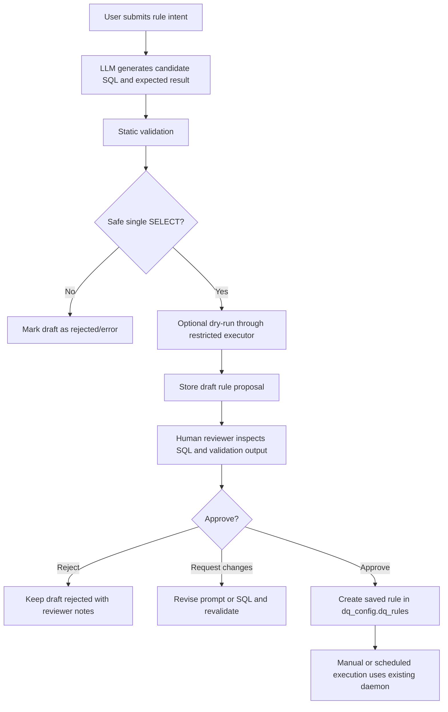
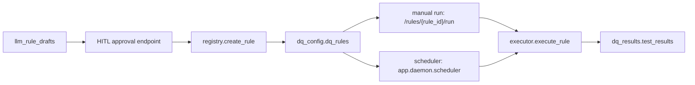

# LLM Validation And HITL Architecture

This document explains the next implementation milestone for the current pushed codebase: an LLM-assisted rule drafting and validation layer with a human-in-the-loop approval flow.

The current project has only implemented the Data Quality Daemon foundation:

- SQL safety validation
- Restricted SQL execution
- Saved rule registry
- Manual saved rule execution
- APScheduler-based scheduled execution
- Result persistence into `dq_results.test_results`

The LLM validation layer is not implemented yet. This document describes how it should be added without changing the existing daemon contract.

## Current Foundation

The LLM layer must build on the modules that already exist:

| Existing file | Current responsibility |
| --- | --- |
| `app/api/routes.py` | Exposes `/rules/run`, `/rules`, `/rules/{rule_id}/run`, `/rules/{rule_id}/results`, and `/scheduler/rules`. |
| `app/models/requests.py` | Defines `RuleExecutionRequest`, `SavedRuleCreateRequest`, and `ExpectedResult`. |
| `app/models/responses.py` | Defines API response models for rule execution, saved rules, scheduler classifications, and saved rule results. |
| `app/daemon/sql_safety.py` | Validates that SQL is a single safe `SELECT` statement. |
| `app/daemon/registry.py` | Creates, lists, fetches, and converts saved rules into execution requests. |
| `app/daemon/executor.py` | Executes validated SQL through the restricted database role and persists aggregate results. |
| `app/daemon/evaluator.py` | Evaluates observed numeric values against expected result rules. |
| `app/daemon/scheduler.py` | Loads schedulable saved rules and executes them automatically. |
| `db/init/002_create_tables.sql` | Creates `dq_config.dq_rules` and `dq_results.test_results`. |

The LLM layer should not bypass these modules. Approved SQL must still become a saved rule in `dq_config.dq_rules`, and execution must still happen through `app.daemon.executor.execute_rule`.

## Target Flow

The LLM validation workflow should be:



## Scope For This Milestone

Implement only the LLM validation and approval backend.

Do not implement:

- A frontend
- Result display pages
- CSV or Parquet ingestion
- Natural-language execution without approval
- Direct LLM-created production rules
- Cron auto-creation without human approval

The LLM may propose rules, but a human must approve before anything is inserted into `dq_config.dq_rules`.

## Core Principle

The LLM is not trusted as an executor.

It should only produce a draft proposal. The system must validate the proposal using deterministic code, show the proposal to a human reviewer, and only then create a saved rule using the same `registry.create_rule` path that currently powers `POST /rules`.

This keeps the existing security model intact:

- SQL safety checks stay in `app/daemon/sql_safety.py`.
- Runtime execution stays in `app/daemon/executor.py`.
- Saved rules stay in `dq_config.dq_rules`.
- Scheduler behavior stays based on approved saved rules only.

## Proposed Database Additions

Add a new table for LLM-generated draft rules. Do not store drafts directly in `dq_config.dq_rules`, because that table should continue to represent approved rules only.

Suggested table:

```sql
CREATE TABLE dq_config.llm_rule_drafts (
    draft_id BIGSERIAL PRIMARY KEY,
    source_prompt TEXT NOT NULL,
    rule_name TEXT,
    sql_text TEXT,
    expected_result_type TEXT,
    expected_result_value NUMERIC NULL,
    schedule_cron TEXT NULL,
    validation_status TEXT NOT NULL,
    validation_errors JSONB NOT NULL DEFAULT '[]'::jsonb,
    dry_run_status TEXT NULL,
    dry_run_observed_key TEXT NULL,
    dry_run_observed_value NUMERIC NULL,
    dry_run_error_message TEXT NULL,
    reviewer_status TEXT NOT NULL DEFAULT 'pending_review',
    reviewer_notes TEXT NULL,
    approved_rule_id BIGINT NULL REFERENCES dq_config.dq_rules(rule_id),
    created_at TIMESTAMPTZ NOT NULL DEFAULT NOW(),
    updated_at TIMESTAMPTZ NOT NULL DEFAULT NOW()
);
```

Suggested status values:

| Column | Values |
| --- | --- |
| `validation_status` | `valid`, `invalid`, `error` |
| `dry_run_status` | `PASS`, `FAIL`, `ERROR`, `not_run` |
| `reviewer_status` | `pending_review`, `approved`, `rejected`, `changes_requested` |

Add a timestamp update trigger if the project starts using triggers for `updated_at`. Otherwise update `updated_at` explicitly in repository functions.

## Proposed Modules

Add the LLM layer as a separate package so the daemon stays clean:

```text
app/
  llm/
    __init__.py
    prompts.py
    provider.py
    validator.py
    drafts.py
```

### `app/llm/provider.py`

Responsibility:

- Wrap the LLM API client.
- Accept a user rule intent.
- Return structured candidate output.

The provider should return a Python object, not raw prose.

Suggested candidate shape:

```python
class LLMRuleCandidate(BaseModel):
    rule_name: str
    sql: str
    expected_result: ExpectedResult
    schedule_cron: str | None = None
```

The provider should not save rules and should not execute SQL.

### `app/llm/prompts.py`

Responsibility:

- Hold prompt templates.
- Include strict generation constraints.
- Instruct the model to output only structured JSON.

Prompt constraints should match the current daemon:

- Generate one PostgreSQL `SELECT` statement only.
- Return one row and one numeric aggregate column.
- Name the aggregate column `violation_count` or `observed_value`.
- Prefer `violation_count` for violation-counting rules.
- Do not use `INSERT`, `UPDATE`, `DELETE`, `DROP`, `ALTER`, `TRUNCATE`, or `CREATE`.
- Do not use unsafe PostgreSQL functions blocked by `app/daemon/sql_safety.py`.
- Query only schemas and tables that are allowed for data quality checks.

### `app/llm/validator.py`

Responsibility:

- Deterministically validate LLM output.
- Convert validation errors into reviewable messages.
- Optionally perform a restricted dry-run.

This module should call existing code instead of duplicating checks:

- Use `app.daemon.sql_safety.validate_safe_select` for SQL safety.
- Use `app.daemon.cron.validate_cron_expression` for schedule validation.
- Use `RuleExecutionRequest` and `ExpectedResult` from `app.models.requests`.
- Use `app.daemon.executor.execute_rule` only for dry-runs.

Suggested validation steps:

1. Ensure `rule_name` is present.
2. Ensure `sql` is present.
3. Validate `expected_result` with the existing Pydantic model.
4. Validate SQL using `validate_safe_select`.
5. Validate `schedule_cron` if provided.
6. Optionally dry-run SQL using the restricted executor.
7. Return a validation report.

Important: a dry-run result of `FAIL` should not automatically reject the draft. A failing rule can be valid and useful. For example, it may correctly find existing bad data. Reject only unsafe SQL, invalid expected result shape, invalid cron, or invalid result shape.

### `app/llm/drafts.py`

Responsibility:

- Persist draft proposals.
- List draft proposals for review.
- Fetch one draft proposal.
- Update reviewer status.
- Approve a draft by creating a real saved rule.

Approval must call `app.daemon.registry.create_rule`.

That means approval should reuse the same validation path as `POST /rules`. The implementation should not insert directly into `dq_config.dq_rules`.

## Proposed API Endpoints

Add these routes without changing existing routes.

Suggested file:

```text
app/api/llm_routes.py
```

Then include that router from `app/main.py`.

### `POST /llm/rules/draft`

Create an LLM-generated draft from a human intent.

Request:

```json
{
  "prompt": "No active employee should have a negative salary",
  "schedule_cron": null,
  "dry_run": true
}
```

Response:

```json
{
  "draft_id": 1,
  "source_prompt": "No active employee should have a negative salary",
  "rule_name": "No active employee has negative salary",
  "sql": "SELECT COUNT(*) AS violation_count FROM business_data.employees WHERE status = 'active' AND salary < 0;",
  "expected_result": {
    "type": "zero_violations",
    "value": null
  },
  "schedule_cron": null,
  "validation_status": "valid",
  "validation_errors": [],
  "dry_run": {
    "status": "FAIL",
    "observed_key": "violation_count",
    "observed_value": 10,
    "error_message": null
  },
  "reviewer_status": "pending_review",
  "approved_rule_id": null
}
```

### `GET /llm/rules/drafts`

List draft rule proposals.

Support filters later if needed:

- `reviewer_status`
- `validation_status`
- `limit`

### `GET /llm/rules/drafts/{draft_id}`

Return one draft proposal and its validation report.

### `POST /llm/rules/drafts/{draft_id}/approve`

Approve a draft and create a saved rule.

This endpoint must:

1. Load the draft.
2. Verify `reviewer_status` is not already `approved`.
3. Verify `validation_status = valid`.
4. Build a `SavedRuleCreateRequest`.
5. Call `registry.create_rule`.
6. Store the returned `rule_id` in `approved_rule_id`.
7. Mark the draft as `approved`.

Response should include both the draft and the created saved rule.

### `POST /llm/rules/drafts/{draft_id}/reject`

Reject a draft.

Request:

```json
{
  "reviewer_notes": "The SQL does not match the business definition of active employees."
}
```

### `POST /llm/rules/drafts/{draft_id}/request-changes`

Mark a draft as needing changes.

Request:

```json
{
  "reviewer_notes": "Use department-specific salary checks instead of a global check."
}
```

This endpoint does not need to call the LLM again in the first implementation. A later iteration can add revision support.

## HITL Review Rules

The human-in-the-loop layer exists because LLM-generated SQL should not become an active rule automatically.

The reviewer should inspect:

- Rule name
- Source prompt
- Generated SQL
- Expected result type and value
- Optional schedule
- SQL validation errors
- Dry-run result
- Dry-run error, if any

Approval should be blocked when:

- SQL safety validation failed
- Expected result validation failed
- Cron validation failed
- Dry-run produced a result shape error
- The draft is already approved

Approval should be allowed when:

- SQL is safe
- Expected result is valid
- Cron is null or valid
- Dry-run is disabled
- Dry-run returns `PASS`
- Dry-run returns `FAIL`

A dry-run `FAIL` means the rule found a real violation. It does not mean the rule definition is bad.

## Integration With Existing Rule Registry

Approved LLM drafts should become normal saved rules.



After approval, no special LLM path is needed for execution. The existing manual and scheduled execution paths should work unchanged.

## Validation Boundaries

The LLM validator should perform two kinds of validation.

### Static Validation

Static validation should happen before any SQL execution:

- Pydantic request validation
- SQL safety validation through `validate_safe_select`
- Cron validation through `validate_cron_expression`
- Expected result validation through `ExpectedResult`

### Runtime Dry-Run Validation

Runtime validation should be optional but recommended.

It should call:

```python
await executor.execute_rule(rule_execution_request)
```

This gives the same protections as the current daemon:

- Restricted `dq_executor` database role
- Read-only transaction
- Statement timeout
- Single-row result check
- Single-column result check
- Numeric aggregate result check
- Result persistence into `dq_results.test_results`

However, there is one design decision to make before implementation:

Dry-runs currently would persist into `dq_results.test_results` because `execute_rule` always persists results. If dry-runs should not appear as official rule results, add an executor option such as:

```python
async def execute_rule(rule: RuleExecutionRequest, persist: bool = True) -> RuleExecutionResult:
    ...
```

Then the LLM validator can call:

```python
await executor.execute_rule(request, persist=False)
```

If this option is not added, dry-run results will be persisted with `rule_id = null`.

Recommended implementation: add `persist=False` support before enabling LLM dry-runs.

## Prompt Contract

The LLM prompt should force output into a strict JSON shape:

```json
{
  "rule_name": "No active employee has negative salary",
  "sql": "SELECT COUNT(*) AS violation_count FROM business_data.employees WHERE status = 'active' AND salary < 0;",
  "expected_result": {
    "type": "zero_violations",
    "value": null
  },
  "schedule_cron": null
}
```

Do not ask the LLM for a final status. The daemon already computes `PASS`, `FAIL`, and `ERROR`.

Do not ask the LLM to produce notification text in this layer. Notification/reporting can consume persisted execution results later.

## Required Settings

Add settings in `app/settings.py`:

```python
llm_provider: str = "openai"
llm_model: str = "..."
llm_api_key: str | None = None
llm_request_timeout_seconds: int = 30
llm_dry_run_enabled: bool = True
```

Secrets should be loaded through environment variables and documented in `.env.example`.

Do not commit real API keys.

## Required Tests

Add tests that prove the LLM layer respects the existing daemon architecture.

Suggested test files:

```text
tests/test_llm_validator.py
tests/test_llm_drafts.py
tests/test_llm_routes.py
```

Minimum tests:

- Valid LLM candidate passes static validation.
- Unsafe SQL from the LLM is rejected.
- Invalid cron from the LLM is rejected.
- Invalid expected result is rejected.
- Dry-run calls the existing executor path.
- Dry-run `FAIL` does not block review.
- Draft creation stores validation status and errors.
- Approving a valid draft calls `registry.create_rule`.
- Approving an invalid draft is rejected.
- Rejecting a draft stores reviewer notes.
- Existing `/rules`, `/rules/run`, and scheduler tests still pass.

For provider tests, mock the LLM client. Do not call a real LLM from unit tests.

## Implementation Checklist

1. Add `dq_config.llm_rule_drafts` in a new init SQL migration.
2. Add Pydantic models for LLM draft requests and responses.
3. Add `app/llm/provider.py` with a mockable provider interface.
4. Add `app/llm/prompts.py` with the generation contract.
5. Add `app/llm/validator.py` using existing SQL safety, cron, and executor modules.
6. Add `app/llm/drafts.py` for draft persistence and approval.
7. Add `app/api/llm_routes.py`.
8. Include the new router in `app/main.py`.
9. Add `.env.example` placeholders for LLM settings.
10. Add tests for validator, draft persistence, approval, and route behavior.
11. Update `README.md` with LLM draft and HITL usage.

## Non-Goals

These should remain outside this implementation:

- Auto-approving LLM-generated rules
- Running LLM-generated SQL before deterministic safety validation
- Replacing `validate_safe_select`
- Replacing `executor.execute_rule`
- Replacing `registry.create_rule`
- Building a frontend review screen
- Sending notifications
- Rendering user-facing reports
- Adding CSV or Parquet data sources

## Final Architecture Summary

The LLM layer should be a proposal and validation system, not a second executor.

The correct architecture is:

1. LLM generates a draft rule.
2. Deterministic validator checks it.
3. Optional dry-run uses the existing restricted executor.
4. Human reviewer approves or rejects it.
5. Approved drafts become saved rules through `registry.create_rule`.
6. Existing manual execution and scheduler flows run the approved rule.

This keeps the LLM feature aligned with the code that is already pushed and preserves the daemon's security boundary.
