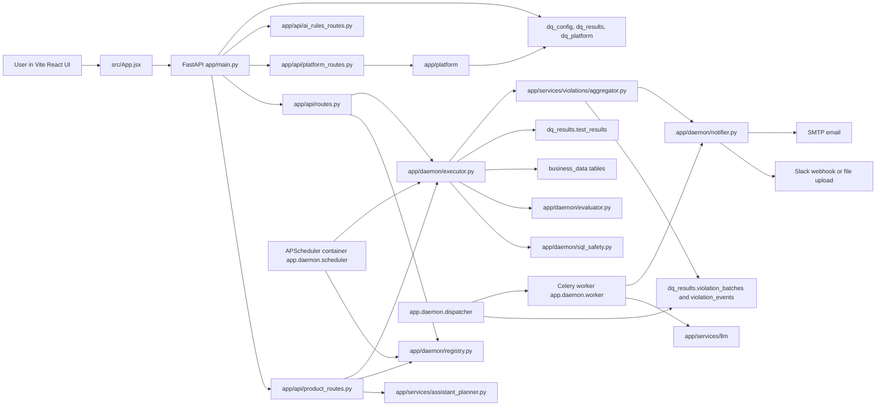
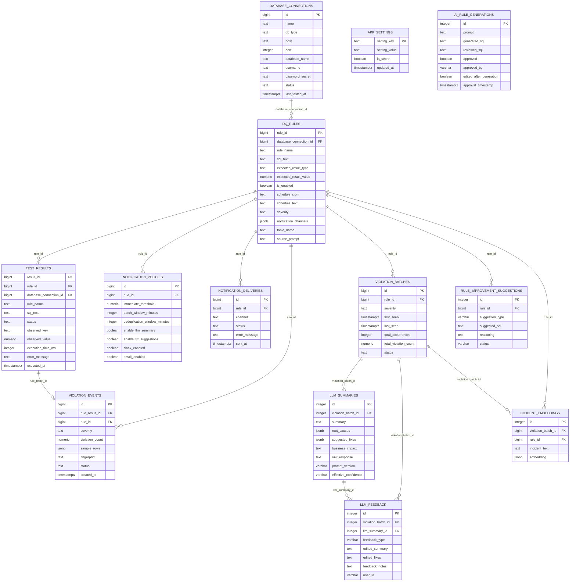
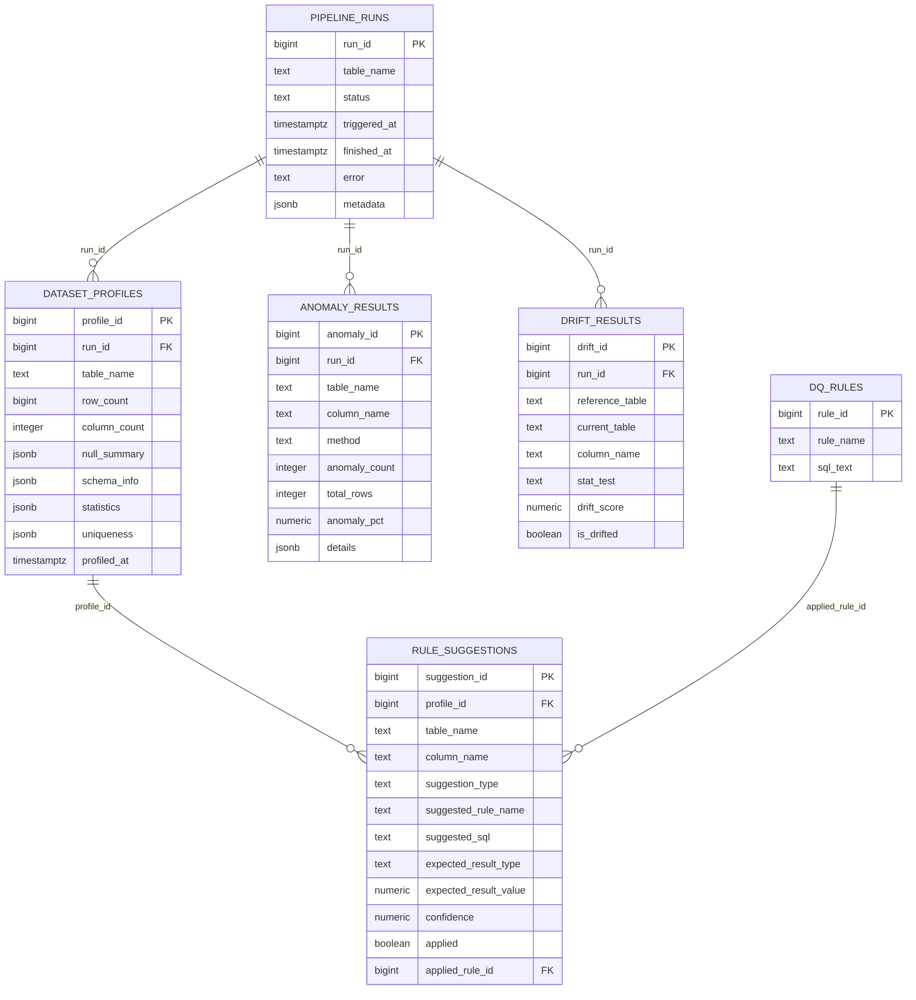

# HPE Data Quality Daemon - Milestone Architecture Guide

This document explains the current codebase as it exists in this branch. It is written for a walkthrough with a manager or teammate: what each part does, where the code lives, how data moves through the system, and what is incomplete or risky.

## Current Timezone UI Status

The AI Command review screen now shows both the scheduler timezone and a selectable next-run preview timezone.

- Backend preview code is in `app/services/schedule_preview.py`.
- The assistant plan response model exposes it through `AssistantPlanResponse.schedule_preview` in `app/models/product.py`.
- `app/services/assistant_planner.py` calls `build_schedule_preview(schedule_cron)` when a natural-language plan is generated.
- `src/App.jsx` renders `Scheduler TZ`, the cron expression, a `Preview timezone` selector, and next-run cards for IST, UTC, New York, and London.
- The selector changes the displayed preview time only. The actual scheduler timezone is controlled by `SCHEDULER_TIMEZONE`, which defaults to `Asia/Kolkata` in `app/settings.py` and `docker-compose.yml`.

So the current frontend answers "when will this run in the timezone I select?", while backend execution remains tied to the configured scheduler timezone.

## What The Application Does

The system is a database-backed data quality platform. The main source of data is PostgreSQL. Users can:

- Connect a PostgreSQL database target.
- Ask for a data quality job in natural language.
- Review generated SQL before saving it.
- Save rules into a persistent registry.
- Run saved rules manually.
- Schedule saved rules through APScheduler.
- Store every execution result in PostgreSQL.
- Fetch previews of violating rows for simple `COUNT(*) AS violation_count ... WHERE ...` SQL shapes.
- Send notifications for `FAIL` and `ERROR` outcomes through Slack and email.
- Track alerts, notification deliveries, violation batches, AI summaries, and human feedback.
- Use Platform Intelligence endpoints for profiling, rule suggestions, anomaly detection, drift checks, and pipeline tracking.

The core daemon still treats SQL execution as the source of truth. Rule type labels, natural-language prompts, and UI metadata do not decide pass/fail directly. The SQL result and `expected_result` do.

## Runtime Architecture



## Docker Runtime

`docker-compose.yml` defines these containers:

- `postgres`: PostgreSQL 16. It runs all SQL and shell init scripts from `db/init`.
- `api`: FastAPI service. Default command comes from `Dockerfile`: `uvicorn app.main:app --host 0.0.0.0 --port 8000`.
- `scheduler`: APScheduler daemon. Command: `python -m app.daemon.scheduler`.
- `dispatcher`: violation batch dispatcher. Command: `python -m app.daemon.dispatcher`.
- `redis`: Redis broker used by Celery when async LLM dispatch is available.
- `llm_worker`: Celery worker. Command: `celery -A app.daemon.worker worker --loglevel=info`.

The frontend is not a Docker Compose service. It is a Vite React app run locally with `npm run dev`.

## Database Architecture

The init scripts create four main schemas:

- `business_data`: mock company data used as the source database.
- `dq_config`: saved rules, database connections, notification policies, runtime settings.
- `dq_results`: execution history, alerts, notifications, LLM summaries, feedback, embeddings, rule improvements.
- `dq_platform`: profiling, suggestions, anomaly results, drift results, pipeline runs.

### Core ER Diagram



### Platform ER Diagram



## API Surface

### Core daemon endpoints in `app/api/routes.py`

- `GET /health`: simple health check from `app/main.py`.
- `POST /connect-database`: legacy direct table connection endpoint.
- `POST /rules/run`: executes ad hoc SQL immediately. It preserves Milestone 1 behavior.
- `POST /rules`: saves a SQL rule after safety and cron validation.
- `GET /rules`: lists saved rules.
- `GET /rules/{rule_id}`: returns one saved rule.
- `DELETE /rules/{rule_id}`: deletes a saved rule and detaches historical `test_results.rule_id`.
- `POST /rules/{rule_id}/run`: runs a saved rule immediately.
- `GET /rules/{rule_id}/results`: returns recent results for one saved rule.
- `GET /results`: returns recent results across all rules.
- `GET /scheduler/rules`: classifies rules as `schedulable`, `disabled`, `missing_schedule`, or `invalid_cron`.
- `GET /violations`: lists violation events.
- `GET /violations/{violation_id}`: returns one violation event.
- `GET /violation-batches`: lists violation batches with latest AI summary if available.
- `POST /violation-batches/{batch_id}/send-now`: manually dispatches a batch.
- `POST /violation-batches/{batch_id}/re-enrich`: triggers an AI re-enrichment attempt.
- `GET /metrics`: returns aggregate alert and LLM metrics.
- `POST /violation-batches/{batch_id}/feedback`: stores human feedback on an AI summary.
- `GET /violation-batches/{batch_id}/feedback`: returns feedback history.

### Product workspace endpoints in `app/api/product_routes.py`

These are what the main SPA in `src/App.jsx` uses.

- `POST /databases`: saves a PostgreSQL connection.
- `GET /databases`: lists saved database targets.
- `POST /databases/{database_id}/test`: tests a saved target.
- `GET /databases/{database_id}/schema`: fetches visible schemas, tables, and columns.
- `DELETE /databases/{database_id}`: deletes a saved database connection.
- `GET /settings`: returns masked AI and notification settings.
- `PATCH /settings/ai`: saves AI provider, model, and API key.
- `PATCH /settings/notifications`: saves email and Slack settings.
- `POST /assistant/plan`: converts natural language into a reviewed rule plan.
- `POST /assistant/approve`: saves the generated plan as a job.
- `GET /orchestrator/jobs`: lists saved jobs.
- `POST /orchestrator/jobs`: creates a job directly.
- `PATCH /orchestrator/jobs/{job_id}`: updates schedule text, severity, channels, and enabled state.
- `POST /orchestrator/jobs/{job_id}/run`: manually runs a job.
- `POST /orchestrator/jobs/{job_id}/pause`: disables a job.
- `POST /orchestrator/jobs/{job_id}/resume`: enables a job.
- `DELETE /orchestrator/jobs/{job_id}`: deletes a job.
- `GET /alerts`: returns violation events for the frontend Alerts tab.
- `GET /notifications`: returns notification delivery logs.
- `GET /dashboard/summary`: returns top-level metrics for the Dashboard tab.

### Platform Intelligence endpoints in `app/api/platform_routes.py`

- `POST /platform/pipeline/trigger`: creates a pipeline run and launches background profiling/suggestion/anomaly work.
- `GET /platform/pipeline/runs`: lists pipeline runs.
- `GET /platform/pipeline/runs/{run_id}`: returns one pipeline run.
- `POST /platform/profile`: profiles a table.
- `GET /platform/profile/{table_name}`: returns the latest profile for a table.
- `POST /platform/suggestions`: profiles a table, generates rule suggestions, validates suggestion SQL, and persists suggestions.
- `GET /platform/suggestions`: lists persisted suggestions.
- `POST /platform/suggestions/{suggestion_id}/apply`: promotes a suggestion into `dq_config.dq_rules`.
- `POST /platform/anomaly/detect`: detects anomalies on selected numeric columns.
- `GET /platform/anomaly/results`: lists anomaly results.
- `POST /platform/drift/detect`: compares numeric distributions between two tables.
- `GET /platform/drift/results`: lists drift results.

### Legacy AI rule endpoints in `app/api/ai_rules_routes.py`

These are separate from the current product `AI Command` flow.

- `POST /ai-rules/generate`: legacy natural-language SQL generation path.
- `POST /ai-rules/dry-run`: runs SQL through legacy dry-run logic.
- `POST /ai-rules/save`: approves a generation record, stores the reviewed SQL, creates a saved rule, and returns the new `saved_rule_id`.
- `GET /ai-rules/history/{generation_id}`: gets a generation record.
- `GET /ai-rules/export`: exports approved generation rows as JSONL.
- `POST /ai-rules/score-rules`: starts background rule-quality scoring.
- `GET /ai-rules/suggestions/{rule_id}`: generates a rule improvement suggestion.
- `POST /ai-rules/suggestions/{suggestion_id}/status`: updates suggestion status.
- `GET /ai-rules/correlations/{batch_id}`: finds similar incident embeddings.

## Main Business Logic Flows

### 1. App startup

1. `docker compose up` starts Postgres, Redis, API, scheduler, dispatcher, and LLM worker.
2. Postgres runs scripts under `db/init` only when its data volume is first created.
3. `app/main.py` starts FastAPI and runs `ensure_product_schema()` in the lifespan handler.
4. `ensure_product_schema()` creates missing product tables and columns for existing volumes and inserts a default "Docker Demo Postgres" database connection if none exists.
5. The frontend runs separately with Vite and calls the API at `VITE_API_BASE_URL` or `http://localhost:8000`.

### 2. Ad hoc SQL rule execution

1. Client calls `POST /rules/run`.
2. `app/api/routes.py::run_rule` passes the request to `app/daemon/executor.py::execute_rule`.
3. `execute_rule` calls `validate_safe_select` from `app/daemon/sql_safety.py`.
4. SQL is wrapped as `SELECT * FROM (<user_sql>) AS dq_rule_result LIMIT 2`.
5. The executor opens a read-only transaction and applies `statement_timeout`.
6. The result must be exactly one row and one column.
7. The output column must be named `violation_count` or `observed_value`.
8. The output value must be numeric.
9. `app/daemon/evaluator.py::evaluate_observed_value` compares the number to the expected result.
10. `dq_results.test_results` receives the aggregate result and metadata.
11. If status is `FAIL` or `ERROR`, `process_violation` starts notification or batching.
12. The API returns a `RuleExecutionResult`.

### 3. Saved rule creation

1. Client calls `POST /rules` or `POST /orchestrator/jobs`.
2. Product job endpoints can accept either direct `schedule_cron` or user-friendly `schedule_text`.
3. `app/services/schedule_parser.py::parse_schedule_to_cron` converts supported text schedules into cron and raises `ScheduleParseError` for unsupported intervals.
4. `app/daemon/registry.py::create_rule` validates SQL with `validate_safe_select`.
5. If `schedule_cron` exists, `app/daemon/cron.py::validate_cron_expression` validates it as a 5-field cron expression.
6. Rule metadata is inserted into `dq_config.dq_rules`.
7. Stored fields include rule name, SQL, expected result, schedule, enabled state, severity, notification channels, source prompt, table name, and database connection.

### 4. Manual saved rule execution

1. Client calls `POST /rules/{rule_id}/run` or `POST /orchestrator/jobs/{job_id}/run`.
2. Registry loads the saved rule.
3. `registry.execution_request_from_saved_rule` converts it into `RuleExecutionRequest`.
4. `executor.execute_rule` executes it using the same safety, transaction, timeout, result shape, persistence, and notification path as ad hoc execution.

### 5. Scheduled saved rule execution

1. `scheduler` container runs `python -m app.daemon.scheduler`.
2. `run_scheduler_forever` creates an `AsyncIOScheduler` with timezone `SCHEDULER_TIMEZONE`.
3. `load_scheduled_rules` reads all saved rules from `dq_config.dq_rules`.
4. Each enabled rule with a valid `schedule_cron` is converted to an APScheduler `CronTrigger`.
5. Scheduler registers one job per schedulable rule.
6. `refresh_scheduled_rules` reloads the registry every 60 seconds.
7. Unchanged jobs are left in place, changed jobs are replaced, and removed/disabled/unscheduled rules have their APScheduler jobs removed.
8. Refresh errors are logged and the scheduler loop keeps running.
9. When a job fires, `execute_scheduled_rule` sleeps for random jitter, then calls the same saved-rule execution path.
10. Results land in `dq_results.test_results` with the correct `rule_id`.
11. Failures and errors go through the same violation aggregation and notification path as manual runs.

### 6. Natural-language AI Command flow

1. User types a natural-language command in `src/App.jsx`.
2. `src/services/productApi.js::planCommand` calls `POST /assistant/plan`.
3. `app/services/assistant_planner.py::create_assistant_plan` rejects a small set of prompt injection phrases.
4. It chooses a database connection and fetches schema with `get_database_schema`.
5. It tries the configured AI provider from `dq_config.app_settings` or environment variables.
6. If the provider fails or has no key, it falls back to `_plan_with_heuristics`.
7. The generated SQL is validated with `validate_ai_generated_sql`.
8. The SQL is dry-run in a read-only transaction against the selected database.
9. The generated plan is logged in `dq_results.ai_rule_generations`.
10. If a schedule was inferred, `build_schedule_preview` adds next-run previews in multiple timezones.
11. The UI shows the plan and waits for the user to approve it.
12. `POST /assistant/approve` saves the plan as a normal saved rule/job.

### 7. Notification and alert flow

1. `executor.execute_rule` calls `_notify_if_needed` only for `FAIL` and `ERROR`.
2. `_notify_if_needed` calls `app/services/violations/aggregator.py::process_violation`.
3. Ad hoc rules have no `rule_id`, so they bypass batching and call `notify_admin_of_failure` directly.
4. Saved rules use severity and policy data from `dq_config`.
5. The aggregator fingerprints the violation using rule id, status, and sample rows.
6. Duplicates inside the deduplication window are aggregated and do not re-notify channels that already received the incident.
7. If a duplicate failure happens after a user enables a new channel, the aggregator dispatches only the missing newly requested channel.
8. New non-duplicate failures create or update `dq_results.violation_events` and `dq_results.violation_batches`.
9. `_dispatch_batch_immediately` currently tries inline AI enrichment and notification delivery.
10. `app/daemon/notifier.py` sends Slack and email if those runtime settings are configured.
11. Slack can be delivered through a webhook or through bot-token file upload when a Slack channel is configured.
12. `notify_admin_of_failure` returns a `NotificationDispatchOutcome` with attempted, sent, failed, and skipped counts.
13. Every attempted Slack/email delivery is written to `dq_results.notification_deliveries`.
14. Violation batches are marked `dispatched` only when at least one requested notification channel actually sends; otherwise they are marked `failed` for operator visibility.

### 8. Platform Intelligence flow

1. `app/api/platform_routes.py` receives a platform request.
2. Profiling uses `app/platform/profiling/profiler.py` and helper analyzers to read table data into Polars.
3. Rule suggestions come from `heuristic_engine.py` or `gemini_engine.py`.
4. Suggested SQL is checked by `query_planner.py` before it is stored.
5. Anomaly detection uses lightweight NumPy/Pandas methods in `anomaly_detector.py`.
6. Drift detection uses a lightweight numeric mean-shift method in `drift_detector.py`.
7. Pipeline orchestration in `flow_controller.py` chains profile, suggestions, anomaly detection, and final status updates.

## SQL Safety Logic

The SQL safety validator is `app/daemon/sql_safety.py::validate_safe_select`.

It is a regex/token validator, not a SQL AST parser. It does these checks:

- Removes line comments and block comments through `_strip_comments`.
- Masks quoted string and identifier literals through `_mask_quoted_literals`.
- Allows only one statement through `_ensure_single_statement`.
- Allows a single trailing semicolon.
- Requires the first token to be `SELECT`.
- Blocks dangerous tokens: `ALTER`, `CALL`, `COPY`, `CREATE`, `DELETE`, `DO`, `DROP`, `GRANT`, `INSERT`, `MERGE`, `REVOKE`, `TRUNCATE`, `UPDATE`, `VACUUM`.
- Blocks unsafe functions: `dblink`, `lo_export`, `lo_import`, `pg_ls_dir`, `pg_read_binary_file`, `pg_read_file`, `pg_sleep`.

Runtime shape checks happen in `app/daemon/executor.py`:

- The query must return exactly one row.
- The row must have exactly one column.
- The column must be named `violation_count` or `observed_value`.
- The value must be numeric and not boolean.
- The result is evaluated against the saved `expected_result`.

CTEs that start with `WITH` are not allowed by the current validator because the first token must be `SELECT`. Subqueries inside a `SELECT` can pass if they do not include blocked tokens and the runtime result shape is correct. Non-aggregate single-row numeric `SELECT` queries can pass validation if they return one numeric column named `violation_count` or `observed_value`.

## Expected Result Semantics

`app/daemon/evaluator.py::evaluate_observed_value` supports:

- `zero_violations`: pass when observed value equals `0`.
- `min_threshold`: pass when observed value is greater than or equal to `expected_result.value`.
- `max_threshold`: pass when observed value is less than or equal to `expected_result.value`.
- `equals`: pass when observed value equals `expected_result.value`.

For validation-style rules, SQL normally returns `violation_count`, and `zero_violations` is common. For query-style rules, SQL can return `observed_value`, and thresholds such as `min_threshold` or `equals` are usually more appropriate.

## Violation Row Preview

Violating rows are not persisted in `dq_results.test_results`. That table stores only the aggregate outcome and metadata.

Preview rows are returned live in the API response only when:

- The rule returned `violation_count`.
- The observed value is greater than `0`.
- The final status is `FAIL`.
- The SQL matches the simple regex shape `SELECT COUNT(*) AS violation_count FROM ... WHERE ...`.
- The extracted `WHERE` clause does not contain `GROUP BY`, `HAVING`, `ORDER BY`, `LIMIT`, or `OFFSET`.

When that shape matches, `executor._fetch_violation_preview` builds `SELECT * FROM <same from> WHERE <same where> LIMIT 50` and returns those rows. Alert events may store those sample rows in `dq_results.violation_events.sample_rows`; the permanent execution history table does not.

## File-By-File Guide

### Root files

- `guide.md`: original architecture and milestone specification.
- `README.md`: user-facing run instructions and endpoint examples.
- `explanation.md`: earlier explanatory document with API and database diagrams.
- `milestone.md`: this current architecture guide.
- `Dockerfile`: builds the Python API image, installs `requirements.txt`, copies `app`, `tests`, and `pytest.ini`, exposes port 8000.
- `docker-compose.yml`: declares Postgres, API, scheduler, dispatcher, Redis, and Celery worker runtime services.
- `.gitignore`: keeps local secrets, build artifacts, caches, virtual environments, and generated files out of git.
- `.env.example`: example environment variables. Real secrets should stay in `.env`, not committed.
- `requirements.txt`: Python dependencies for FastAPI, SQLAlchemy, APScheduler, Slack, platform intelligence, Celery, and LLM integrations.
- `pytest.ini`: pytest configuration.
- `package.json` and `package-lock.json`: Vite/React frontend package metadata and locked dependency versions.
- `vite.config.js`: Vite configuration.
- `tailwind.config.js` and `postcss.config.js`: Tailwind/PostCSS setup.
- `index.html`: Vite entry HTML.

### Database init files

- `db/init/001_create_schemas.sql`: creates `business_data`, `dq_config`, and `dq_results`.
- `db/init/002_create_tables.sql`: creates `business_data.employees`, `business_data.students`, `dq_config.dq_rules`, and `dq_results.test_results`.
- `db/init/003_create_roles.sh`: creates `dq_executor` and `dq_app`, sets passwords from env, and grants least-privilege database access.
- `db/init/004_seed_data.sql`: seeds 100,000 employee rows and 10,000 student rows using bulk `generate_series`.
- `db/init/005_platform_intelligence.sql`: creates `dq_platform` tables for pipeline runs, profiles, suggestions, anomalies, and drift.
- `db/init/006_intelligent_alerts.sql`: adds rule severity, notification policies, violation events, and violation batches.
- `db/init/007_llm_summaries.sql`: creates `dq_results.llm_summaries`.
- `db/init/008_llm_schema_updates.sql`: adds LLM summary audit fields and removes the one-summary-per-batch uniqueness constraint.
- `db/init/009_llm_feedback.sql`: creates human feedback storage for LLM summaries.
- `db/init/010_ai_rule_generation.sql`: creates AI rule generation audit records.
- `db/init/011_rule_improvement_learning.sql`: adds rule quality columns, improvement suggestions, and incident embeddings.
- `db/init/012_product_revamp.sql`: adds database connections, rule metadata columns, notification deliveries, and runtime app settings.

### FastAPI entry and database session

- `app/__init__.py`: package marker.
- `app/main.py`: creates the FastAPI app, registers routers, configures CORS, runs schema bootstrap on startup, and exposes `/health`.
- `app/settings.py`: central environment-backed settings model. Defines DB URLs, timeouts, jitter, scheduler timezone, Slack, SMTP, Celery, LLM, Gemini, and platform settings.
- `app/db/__init__.py`: package marker.
- `app/db/session.py`: creates async SQLAlchemy engines for the restricted executor role and metadata app role.

### API routers

- `app/api/__init__.py`: package marker.
- `app/api/routes.py`: Milestone daemon endpoints for `/rules`, `/results`, scheduler classification, violations, batches, metrics, and feedback.
- `app/api/product_routes.py`: main frontend API for database management, settings, AI command planning, jobs, alerts, notifications, and dashboard summary.
- `app/api/platform_routes.py`: Platform Intelligence API for profiling, suggestions, anomaly detection, drift detection, and pipeline runs.
- `app/api/ai_rules_routes.py`: legacy AI-rule endpoints for generation, dry-run, approval audit, exports, scoring, improvement suggestions, and correlations.

### Request and response models

- `app/models/__init__.py`: package marker.
- `app/models/requests.py`: Pydantic request models for rule execution, saved rule creation, expected results, and legacy database connection.
- `app/models/responses.py`: response models for execution results, saved rules, scheduler statuses, and legacy database connection response.
- `app/models/product.py`: frontend/product models for database connections, AI plans, jobs, dashboard metrics, notifications, and settings.
- `app/models/platform_requests.py`: request models for platform profiling, suggestions, anomaly, drift, and pipeline endpoints.
- `app/models/platform_responses.py`: response models for platform profiles, suggestions, anomalies, drift, and pipeline runs.
- `app/models/violations.py`: Pydantic models for notification policies, violation events, and violation batches.
- `app/models/feedback.py`: Pydantic models for sanitized human feedback and feedback responses.

### Core daemon modules

- `app/daemon/__init__.py`: package marker.
- `app/daemon/sql_safety.py`: SQL validation and helper functions for comment stripping, literal masking, single-statement checks, dangerous keyword blocking, and unsafe function blocking.
- `app/daemon/evaluator.py`: pass/fail logic for the four expected result types.
- `app/daemon/executor.py`: central rule executor. Validates SQL, opens read-only transactions, applies timeout, executes SQL, enforces result shape, fetches optional violation preview, persists results, and triggers notifications.
- `app/daemon/registry.py`: saved-rule persistence. Creates, lists, updates, deletes, converts saved rules to executable requests, and reads execution history.
- `app/daemon/cron.py`: validates 5-field cron expressions, converts cron to APScheduler triggers, and classifies scheduler eligibility.
- `app/daemon/scheduler.py`: long-lived APScheduler daemon. Loads rules, registers jobs, refreshes every minute, applies jitter, and executes scheduled rules.
- `app/daemon/notifier.py`: Slack and email notification delivery. Formats plaintext, HTML, CSV attachment content, sends messages, records delivery rows, and returns a delivery outcome.
- `app/daemon/dispatcher.py`: background loop that scans open violation batches and dispatches expired batches through Celery or inline fallback; failed delivery attempts keep batch status visible as failed.
- `app/daemon/worker.py`: Celery worker task that performs async LLM enrichment and notification dispatch for violation batches and persists dispatch success/failure.
- `app/daemon/connection.py`: legacy direct table connection helper used by `/connect-database`.

### Product and runtime services

- `app/services/__init__.py`: package marker.
- `app/services/schema_bootstrap.py`: ensures core daemon, product, alerting, LLM, AI-rule, and platform tables/grants exist even on old Postgres volumes; seeds the default Docker database connection.
- `app/services/database_connections.py`: creates, lists, tests, deletes, and introspects saved database connections; also builds dynamic target SQLAlchemy engines.
- `app/services/runtime_settings.py`: persists AI and notification runtime settings in `dq_config.app_settings`, masks secrets for API responses, and falls back to environment variables.
- `app/services/assistant_planner.py`: natural-language job planner. Calls AI providers or heuristic fallback, validates SQL, dry-runs SQL, logs generation, and returns a reviewable plan.
- `app/services/schedule_parser.py`: converts simple natural-language schedules like "every 5 minutes" or "daily at 10:30 am" into 5-field cron expressions and rejects unsupported intervals.
- `app/services/schedule_preview.py`: computes next run times in scheduler timezone plus IST, UTC, New York, and London.

### Violation aggregation services

- `app/services/violations/__init__.py`: package marker.
- `app/services/violations/aggregator.py`: receives failed/error rule results, creates violation events and batches, deduplicates repeated failures, and dispatches new incidents.
- `app/services/violations/deduplicator.py`: hashes rule id, status, and sample rows into a fingerprint and checks for recent duplicates.
- `app/services/violations/policies.py`: fetches or creates per-rule notification policies.
- `app/services/violations/llm_hooks.py`: import-safe glue between violation batching and Celery/LLM enrichment.

### LLM enrichment services

- `app/services/llm/__init__.py`: package marker.
- `app/services/llm/orchestrator.py`: fetches violation batch context, builds prompt, calls Groq provider, validates response, persists summary, applies historical feedback, and indexes incident embeddings.
- `app/services/llm/parser.py`: validates LLM summary JSON shape and adjusts confidence with simple heuristics.
- `app/services/llm/sanitizer.py`: redacts PII-like data from rows before LLM prompt construction.
- `app/services/llm/providers/__init__.py`: package marker.
- `app/services/llm/providers/base.py`: abstract provider interface.
- `app/services/llm/providers/groq_provider.py`: async Groq JSON provider with retries and response metadata.
- `app/services/llm/prompts/__init__.py`: package marker.
- `app/services/llm/prompts/summarization.py`: prompt template for violation-batch summaries.

### Legacy AI-rule services

- `app/services/ai_rules/__init__.py`: package marker.
- `app/services/ai_rules/orchestrator.py`: legacy SQL generation coordinator for `/ai-rules/generate`.
- `app/services/ai_rules/sanitizer.py`: prompt injection checks for the legacy AI route.
- `app/services/ai_rules/schema_context.py`: reads table schema and relationship context.
- `app/services/ai_rules/prompts.py`: legacy SQL-generation system prompt and examples.
- `app/services/ai_rules/parser.py`: parses legacy LLM JSON into an `AIRuleResponse`.
- `app/services/ai_rules/validator.py`: stricter AI SQL validator layered on top of daemon SQL safety.
- `app/services/ai_rules/dry_run.py`: legacy read-only SQL dry-run helper.
- `app/services/ai_rules/export.py`: exports approved generation records as sanitized JSONL.
- `app/services/ai_rules/scoring.py`: updates rule quality scores and false-positive rate estimates.
- `app/services/ai_rules/improvement.py`: uses LLM evidence to suggest improvements for noisy rules.
- `app/services/ai_rules/correlation.py`: lightweight sparse embedding and similarity search for historical incidents.

### Platform Intelligence modules

- `app/platform/__init__.py`: package marker.
- `app/platform/logger.py`: loguru-based platform logger helper.
- `app/platform/profiling/__init__.py`: package marker.
- `app/platform/profiling/profiler.py`: loads a database table into Polars and generates a profile.
- `app/platform/profiling/statistics_generator.py`: combines schema, null, uniqueness, distribution, and numeric statistics into one profile.
- `app/platform/profiling/schema_analyzer.py`: infers simplified column types from a Polars dataframe.
- `app/platform/profiling/null_analyzer.py`: computes null percentages.
- `app/platform/profiling/uniqueness_analyzer.py`: computes unique counts and unique percentages.
- `app/platform/profiling/distribution_analyzer.py`: computes top values and distribution summaries.
- `app/platform/detection/__init__.py`: package marker.
- `app/platform/detection/anomaly_detector.py`: lightweight anomaly detection for numeric columns.
- `app/platform/detection/drift_detector.py`: lightweight mean-shift drift detection.
- `app/platform/rule_intelligence/__init__.py`: package marker.
- `app/platform/rule_intelligence/heuristic_engine.py`: generates offline rule suggestions from profile statistics.
- `app/platform/rule_intelligence/gemini_engine.py`: Gemini-backed rule suggestion implementation.
- `app/platform/rule_intelligence/query_planner.py`: SQLGlot parser/validator/compiler for suggested rules.
- `app/platform/orchestration/__init__.py`: package marker.
- `app/platform/orchestration/dependency_manager.py`: defines dependency graph nodes for the platform pipeline.
- `app/platform/orchestration/retry_handler.py`: central retry policy definitions for Prefect tasks.
- `app/platform/orchestration/flow_controller.py`: Prefect-compatible pipeline flow for profile, suggest, anomaly, and finalization.

### Frontend application

- `src/main.jsx`: mounts React, wraps the app in `BrowserRouter`, and imports global CSS.
- `src/App.jsx`: current main SPA. Contains Dashboard, Databases, AI Command, Jobs, Alerts, and Settings views in one mounted component tree. It owns the current UI state, calls the product API client, and renders inline reusable UI helpers such as status chips, info cards, forms, and toast messages.
- `src/index.css`: global app styling, themes, layout, cards, forms, status chips, and responsive behavior.
- `src/services/api.js`: Axios client with base URL and normalized error handling.
- `src/services/productApi.js`: API client for the current main SPA endpoints.

### Tests

- `tests/__init__.py`: package marker.
- `tests/test_sql_safety.py`: SQL safety validator coverage.
- `tests/test_evaluator.py`: expected-result evaluator tests.
- `tests/test_executor.py`: executor behavior, persistence, and error cases.
- `tests/test_routes.py`: API route behavior for rules and results.
- `tests/test_cron.py`: cron parsing and scheduler classification tests.
- `tests/test_scheduler.py`: scheduler rule execution/load tests.
- `tests/test_schedule_parser.py`: natural-language schedule parser tests.
- `tests/test_schedule_preview.py`: schedule preview tests.
- `tests/test_assistant_planner.py`: assistant planner heuristic, prompt safety, dry-run, and schedule preview tests.
- `tests/test_notifier.py`: Slack/email notification behavior tests.
- `tests/test_aggregator.py`: violation aggregation and deduplication tests.
- `tests/test_llm_orchestrator.py`: LLM summary orchestration tests.
- `tests/test_profiler.py`: profiling tests.
- `tests/test_platform_routes.py`: platform API tests.
- `tests/test_query_planner.py`: SQLGlot planner tests.
- `tests/test_heuristic_engine.py`: platform heuristic suggestion tests.
- `tests/test_anomaly_detector.py`: anomaly detection tests.
- `tests/test_drift_detector.py`: drift detection tests.
- `tests/test_flow_controller.py`: pipeline orchestration tests.

## Privilege Separation

Roles are created in `db/init/003_create_roles.sh`.

`dq_executor` is the restricted execution role:

- Can use `business_data`.
- Can `SELECT` from all tables in `business_data`.
- Can use `dq_results`.
- Can `INSERT` into `dq_results.test_results`.
- Can use/select sequences in `dq_results`.

`dq_app` is the metadata/application role:

- Can use and select from `business_data`.
- Can select/insert/update/delete `dq_config.dq_rules`.
- Can use/select sequences in `dq_config`.
- Can select/update `dq_results.test_results` at first, then later migrations grant broader metadata result access.
- Later migrations grant access to product tables, notification tables, LLM tables, platform tables, and app settings.

The intended model is: user SQL runs with `dq_executor`, metadata writes and control-plane operations use `dq_app`.

## Scheduling Details

`app/daemon/cron.py` and `app/daemon/scheduler.py` implement scheduling.

- Cron format is standard 5-field: `minute hour day_of_month month day_of_week`.
- `CronTrigger.from_crontab` parses cron strings.
- `SCHEDULER_TIMEZONE` controls the runtime timezone and defaults to `Asia/Kolkata`.
- `RULE_EXECUTION_JITTER_SECONDS` controls random delay before scheduled execution and defaults to `120`.
- Jobs are configured with `coalesce=True`, `misfire_grace_time=60`, `max_instances=1`, and `replace_existing=True`.
- Schedules are loaded at startup and refreshed every 60 seconds.
- During refresh, `_job_matches_rule` keeps unchanged jobs in place so every refresh does not reset the next run time.
- Changed schedules/rules are replaced, and rules that become disabled, unscheduled, invalid, or deleted have their scheduler jobs removed.
- Refresh failures are logged and do not stop the scheduler process.
- If jitter is longer than the cron interval, `max_instances=1` prevents overlapping runs, and `coalesce=True` can merge missed runs into a single later execution.

## Known Broken, Incomplete, Or Risky Areas

These are current review findings. Several earlier findings have now been addressed in the local working tree, but those changes are not committed yet.

### Recently Addressed In Local Code

1. Frontend timezone visibility.
   - The AI Command review now includes a preview timezone selector and next-run display.
   - Relevant files: `src/App.jsx`, `src/index.css`, `app/services/schedule_preview.py`, `app/models/product.py`.

2. Notification channel preferences.
   - `RuleExecutionRequest` now carries `notification_channels`.
   - Saved rule execution, dispatcher, worker, and notifier paths now honor rule-specific Slack/email choices.
   - Relevant files: `app/models/requests.py`, `app/daemon/registry.py`, `app/daemon/notifier.py`, `app/daemon/dispatcher.py`, `app/daemon/worker.py`.

3. Schedule clearing and friendlier schedule editing.
   - Job updates now distinguish omitted schedule fields from explicit empty schedule fields.
   - Clearing schedule text now clears `schedule_cron`.
   - The Jobs UI now has schedule presets plus editable schedule text.
   - Relevant files: `app/api/product_routes.py`, `app/daemon/registry.py`, `src/App.jsx`.

4. `ViolationBatch` intermediate statuses.
   - The response model now allows `dispatching` and `enriched`.
   - Relevant file: `app/models/violations.py`.

5. Legacy `/ai-rules` route cleanup.
   - The orchestrator now imports the real Groq provider module, pulls dynamic examples from real `dq_rules` rows, validates dry-run SQL, and creates a saved rule when a generation is approved. The legacy prompt template can still contain generic examples, but the orchestrator no longer relies on a hardcoded dummy existing-rule fallback.
   - Relevant files: `app/services/ai_rules/orchestrator.py`, `app/api/ai_rules_routes.py`.

6. Stale comments/docstrings.
   - Worker, aggregator, and platform route comments were aligned with current inline/queued behavior and lightweight drift detection.
   - Relevant files: `app/daemon/worker.py`, `app/services/violations/aggregator.py`, `app/api/platform_routes.py`.

7. Persistence error visibility.
   - `executor._persist_result` now logs persistence exceptions instead of swallowing them silently.
   - Relevant file: `app/daemon/executor.py`.

8. Unsupported schedule intervals are rejected.
   - `parse_schedule_to_cron` now raises `ScheduleParseError` for unsupported minute/hour/day intervals instead of silently clamping them.
   - Product job create/update endpoints catch that error and return HTTP 400.
   - Relevant files: `app/services/schedule_parser.py`, `app/api/product_routes.py`.

9. Notification dispatch outcome is explicit.
   - Slack/email senders now return success/failure.
   - Dispatchers and aggregation paths mark batches as `dispatched` only when at least one requested channel was actually sent.
   - Duplicate failures inside the dedupe window can still dispatch channels that were newly enabled after the first alert.
   - Relevant files: `app/daemon/notifier.py`, `app/services/violations/aggregator.py`, `app/daemon/dispatcher.py`, `app/daemon/worker.py`.

10. Scheduler refresh is safer.
   - The scheduler no longer replaces unchanged jobs on every refresh, and refresh errors are logged without killing the scheduler loop.
   - Relevant file: `app/daemon/scheduler.py`.

11. Schema bootstrap is broader.
   - `ensure_product_schema` now creates core daemon, product, notification, LLM, AI-rule, and platform tables/grants for existing Docker volumes.
   - Relevant file: `app/services/schema_bootstrap.py`.

12. Frontend stale-code cleanup is complete.
   - The main SPA is now the only frontend surface under `src/App.jsx`.
   - Older unmounted route pages, unused common components, old dataset/rule-builder services, and old static assets were removed.
   - Relevant files: `src/App.jsx`, `src/main.jsx`, `src/services/productApi.js`.

### Still Open

1. Secrets are stored in plaintext in the metadata database.
   - `dq_config.database_connections.password_secret` stores database passwords.
   - `dq_config.app_settings.setting_value` stores AI and notification secrets.
   - The API masks secrets on read, but storage is not encrypted.

2. Platform Intelligence reads through the metadata app engine.
   - `app/platform/profiling/profiler.py`, anomaly detection, and drift detection use `metadata_engine` (`dq_app`) to read data.
   - The main executor path uses the more restricted execution model, but platform profiling is broader.

3. API routes do not currently enforce authentication or authorization.
    - Routers are mounted directly in `app/main.py`.
    - A real deployment should add auth before exposing database connection, settings, rule execution, export, and notification endpoints beyond a trusted demo environment.

4. AI planner heuristic is intentionally simple.
    - `_plan_with_heuristics` uses string matching and default table/column fallbacks.
    - It can choose the wrong column if the prompt omits exact schema terms.
    - Prompt injection detection is a small phrase denylist, not a robust LLM security layer.

5. Batch notification design is split between inline and queued paths.
    - Redis/Celery exists, and `llm_hooks.enqueue_batch_dispatch` can enqueue work.
    - The aggregator's immediate path currently calls inline enrichment/notification instead of using the queue first.
    - The dispatcher path does try Celery first, with inline fallback.

6. Platform profiling may be unnecessary for the manager's "source data is pure" assumption.
    - It is implemented and available under `/platform`, but the primary rule execution flow does not require profiling.

7. Manual batch re-enrichment endpoint has an async wrapper risk.
    - `app/api/routes.py::re_enrich_batch` calls `app.daemon.worker._run_async`, which uses `asyncio.run`.
    - In an already-running FastAPI event loop, that can raise a runtime error. The endpoint should be converted to `await generate_batch_summary(...)` or a proper background task.

## What To Show In A Demo

Recommended demo path:

1. Start backend services with Docker Compose.
2. Start frontend with Vite.
3. Open the Dashboard and show connected database/job/failure/notification counts.
4. Open Databases and show the default Docker Demo Postgres connection.
5. Inspect schema for `business_data.employees`.
6. Open AI Command and generate a rule from plain English.
7. Review generated SQL, expected result, schedule, scheduler timezone, and next-run preview.
8. Approve the plan and show it appears in Jobs.
9. Run the job manually from Jobs.
10. Show latest result in Dashboard.
11. If the rule fails, show Alerts and Notification Delivery.
12. Show saved jobs can be paused, resumed, edited, and deleted.
13. Optional: show `/scheduler/rules` through API docs or backend response if frontend needs scheduler classification details.
14. Optional: show Platform Intelligence endpoints separately as prototype intelligence features, not required for the main daemon loop.

## Practical Commands

Backend:

```bash
docker compose up --build
```

Detached backend:

```bash
docker compose up --build -d
```

Backend tests:

```bash
docker compose run --rm --no-deps api pytest
```

Frontend:

```bash
npm install
npm run dev
```

Frontend build:

```bash
npm run build
```

Reset database volume:

```bash
docker compose down -v
docker compose up --build
```
